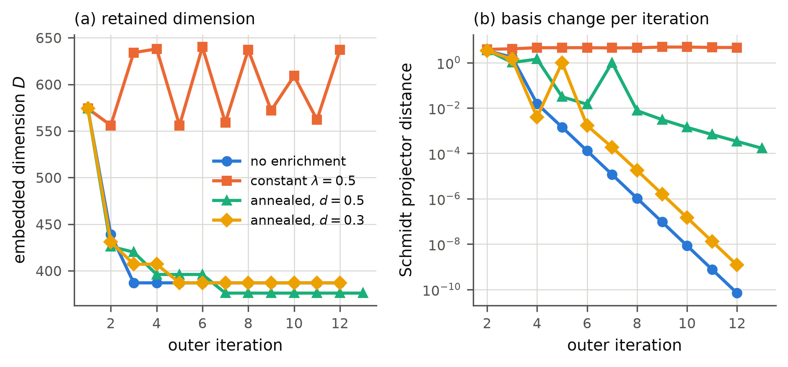
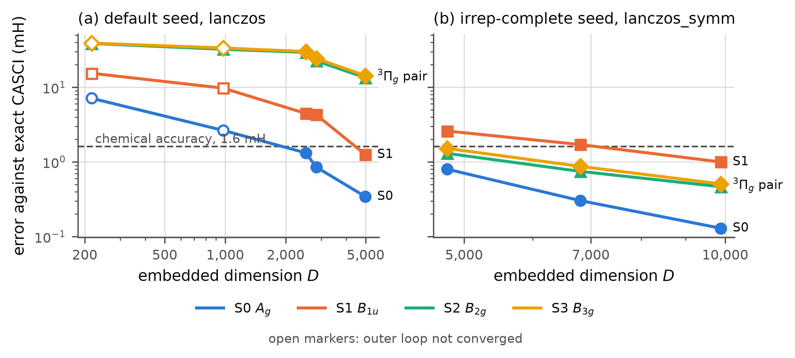
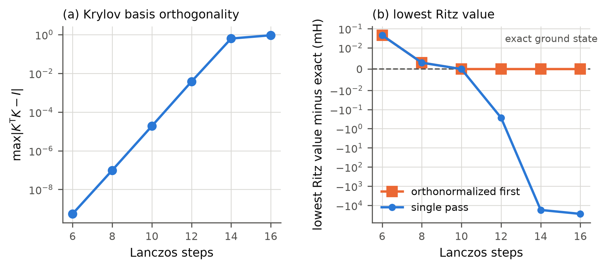

# Self-consistent Schmidt-basis downfolding in configuration interaction: rank contraction, symmetry reachability, and cost

*Draft manuscript. Authors and affiliations to be determined.*

*Status: every number is measured and traceable to a committed artifact under
`results/` or a document under `docs/development/`. References marked `[verify]`
were taken from search metadata and have not yet been checked against a
publisher record.*

## Abstract

Several correlated-wavefunction methods rebuild a truncated many-body basis from
their own approximate wavefunction and iterate to self-consistency; the
density-matrix renormalization group, tensor-product selected configuration
interaction and density-matrix embedding all share this loop. We study the loop in
a concrete and fully instrumented setting: state-averaged Schmidt bases over an
orbital bipartition of a complete-active-space wavefunction, a P/Q partition of
the resulting product basis, and a residual-dressed wave operator solved as a
Hermitian generalized Ritz problem. We establish four properties that do not
depend on the particular downfolding. First, the downfolding is exact at
convergence, so the entire error is basis truncation. Second, the outer map is a
rank contraction: the reconstructed coefficients lie in the span of the basis that
produced them, so the retained rank cannot increase, and a residual enrichment
that restores growth must be annealed, because the residual of a state in a
truncated space cannot vanish and a constant enrichment is a permanent rotation of
the basis. Third, a target state in an irreducible representation that the seed
does not span is unreachable, and the default Krylov seed for such schemes can be
blind to a whole irrep while every convergence indicator reports success. Fourth,
with a seed that spans every target irrep, four states of N2 in CAS(10e,9o)/cc-pVDZ,
including an exactly degenerate 3Πg pair, converge to within chemical accuracy
from a seed that reads no exact configuration-interaction coefficients. The same
measurement shows the approach to be thousands of times more expensive than the
exact solve, for a structural reason we identify: every stage holds dense vectors
over the full active space.

## 1. Introduction

A recurring construction in correlated electronic structure is to represent the
wavefunction in a truncated many-body basis that is itself derived from the
wavefunction. The density-matrix renormalization group (DMRG) builds a
renormalized basis for one part of the system from the reduced density matrix of
the current approximate state and sweeps to self-consistency [White 1992;
Baiardi and Reiher 2020]; its state-averaged variant uses a weighted reduced
density matrix to obtain one basis for several states [Ghosh et al. 2008
[verify]]. Tensor-product selected configuration interaction (TPSCI) computes
cluster bases from the reduced density matrices of the current sparse
wavefunction and iterates until they stop changing, including in a
state-averaged form for excited states [Abraham and Mayhall 2020; Braunscheidel
et al. 2023]. Density-matrix embedding theory constructs a bath from a Schmidt
decomposition of a reference wavefunction [Knizia and Chan 2012], and recent
state-averaged variants share one bath among several states [Guan and Jiang 2026
[verify]].

What these schemes share is an outer map from an approximate wavefunction to a
new basis and back. Whether that map converges, to what, and at what cost is
usually established empirically for each method. Here we study the map directly,
in a setting simple enough to instrument completely and small enough to compare
against the exact answer at every step: a complete-active-space wavefunction
decomposed over an orbital bipartition, a P/Q partition of the resulting Schmidt
product basis, and a downfolding of Q onto P by a shared wave operator. None of
the ingredients is new. The graph-subspace Ritz problem we solve is the
des Cloizeaux form of the Hermitian effective Hamiltonian [des Cloizeaux 1960;
Okamoto et al. 2005]; a single wave operator for several states is the Bloch
construction and the state-universal ansatz [Bloch 1958; Lindgren 1974;
Jeziorski and Monkhorst 1981]; building it from target states by an inverse over
states goes back to Lee and Suzuki [1980 [verify]]; and dressing a CI problem
with outer-space residual effects is the idea behind intermediate Hamiltonians and
dressed selected CI [Garniron et al. 2018 [verify]]. We make no claim of novelty
for the method. The contribution is a set of properties of the outer map that we
can state precisely and measure, most of which carry over to the other members of
the family.

The results are organized around four questions: where the error comes from
(Section 4.1), whether the outer map can improve the basis at all (4.2 to 4.4),
which target states it can reach from an approximate seed (4.5), and what it
achieves and costs when all of these are handled (4.6 and 4.7). Section 4.8
reports a size-consistency failure and its cause, and Section 5 records three
silent numerical defects found along the way, each of which produced plausible,
converged and wrong results.

## 2. The outer map

### 2.1 Schmidt bases over an orbital bipartition

Partition the active orbitals into a set A and its complement B. Every determinant
factorizes into an A string and a B string, and the configuration-interaction
coefficients of state k, grouped by the number n of electrons in A, form
rectangular blocks

$$C_k(n) \in \mathbb{R}^{\dim_A(n) \times \dim_B(N-n)} .$$

For several states with weights $w_k$ the state-averaged reduced densities are

$$\rho_A^{\mathrm{SA}}(n) = \sum_k w_k\, C_k(n) C_k(n)^\dagger, \qquad
\rho_B^{\mathrm{SA}}(n) = \sum_k w_k\, C_k(n)^\dagger C_k(n).$$

We obtain their eigenvectors without forming the densities, from the singular
value decompositions of $M(n) = [\sqrt{w_1}C_1(n) \mid \cdots \mid \sqrt{w_s}C_s(n)]$
and of the corresponding vertical stack, since $MM^\dagger = \rho_A^{\mathrm{SA}}$;
this avoids squaring the condition number. Truncating at a singular-value
threshold $\varepsilon$ gives left and right bases $U(n)$ and $V(n)$ with ranks
$r_A(n)$ and $r_B(n)$ chosen independently, and the Schmidt product basis
$\{|\tilde A_\alpha^{(n)}\rangle \otimes |\tilde B_\beta^{(n)}\rangle\}$ of
dimension $D = \sum_n r_A(n) r_B(n)$.

Two properties of $D$ matter for everything that follows. It is the cost axis for
the comparisons in Section 4, and it is a count over a product grid rather than
over physical determinants: because $C_k(n)$ is structurally sparse in $M_S$ while
the product basis takes every $\alpha\beta$ pair, $D$ can exceed the dimension of
the CI space. For H2O/STO-3G CAS(6e,5o), with 100 determinants, the untruncated
grid holds 196 pairs and $D = 148$ at $\varepsilon = 10^{-4}$.

### 2.2 P/Q partition and downfolding

The product basis is partitioned by electron-number block: states in a chosen set
of blocks form P and the rest form Q. With the embedded Hamiltonian
$H_{\mathrm{emb}}$ in the product basis, a single wave operator
$\Omega: P \to Q$ defines the graph subspace $X = [I;\,\Omega]$, and the
generalized Ritz problem

$$X^\dagger H_{\mathrm{emb}} X\, c = E\, X^\dagger X\, c$$

is Hermitian and energy independent. It is the des Cloizeaux effective
Hamiltonian written without orthogonalization [Okamoto et al. 2005], and it is
variational in the usual Rayleigh-Ritz sense. $\Omega$ is updated from the
Q-space residuals of the Ritz states,

$$\delta q_k = \frac{R_{Q,k}}{E_k - \mathrm{diag}\,H_{QQ}}, \qquad
\delta\Omega = [\delta q_k]\,\mathrm{pinv}([c_k]), \qquad
\Omega \leftarrow \Omega + \eta\,\delta\Omega ,$$

a Davidson-type preconditioner combined with a multi-state least-squares fit. We
do not claim novelty for this update rule.

### 2.3 The outer iteration

Given converged Ritz states, the coefficients are reconstructed in the determinant
basis as

$$C_k^{\mathrm{new}}(n) = U(n)\, T_k(n)\, V(n)^\dagger ,$$

where $T_k(n)$ collects the P amplitudes $c_k$ and the Q amplitudes $\Omega c_k$
in block $n$. The new coefficients are mixed with the old,
$C \leftarrow (1-\alpha) C^{\mathrm{old}} + \alpha C^{\mathrm{new}}$,
orthonormalized, matched to the previous iteration's roots by overlap, and used
to rebuild the state-averaged densities. Exact configuration-interaction
coefficients enter nowhere: the iteration starts from a seed (Section 4.5), and
exact energies are used only to score the result, through an evaluator boundary
guarded by a test that fails if any production code path calls an exact solver.

## 3. Computational details

**Systems.** The principal system is N2 at $R = 1.098$ Å with the cc-pVDZ basis,
restricted Hartree-Fock orbitals, the two 1s-derived orbitals frozen, and a
CAS(10e,9o) active space of 15,876 determinants. The targets are the four lowest
$M_S = 0$ roots, which cover the three lowest energy levels: the $X\,^1\Sigma_g^+$
ground state ($A_g$ in $D_{2h}$), a $^3\Sigma_u^+$ state ($B_{1u}$), and an exactly
degenerate $^3\Pi_g$ pair ($B_{2g}$, $B_{3g}$). The more obvious CAS(10e,10o) choice
was rejected because it contains one member of a degenerate $\pi$ pair and not the
other, which splits the two $^3\Pi_g$ components artificially by 2.99 mH; the
nine-orbital space restores exact degeneracy. A is the five orbitals occupied in
the Hartree-Fock determinant and B the remaining four; P is the electron-number
blocks $n_A \in \{8, 9, 10\}$; the four states carry equal weights, as the
Gross-Oliveira-Kohn ensemble condition requires for the degenerate pair [Gross
et al. 1988 [verify]]. Supporting calculations use H2O/STO-3G CAS(6e,5o),
100 determinants, and two H2/STO-3G molecules 200 Å apart.

**Reference.** All errors are absolute deviations from exact CASCI energies held
in a checksummed reference file
(`ad5b19d6674d54411f704bd3ed4b65aab9741d5373037868fc8fb76e85133d9d`):
$-109.0401239716$, $-108.7408683094$ and twice $-108.7218810454$ Ha. Obtaining it
required care (Section 5): the degenerate pair is recovered reliably only by
symmetry-resolved solves in $D_{2h}$ or by requesting at least six roots and
checking that the lowest four are stable.

**Numerical controls,** fixed in advance and unchanged throughout: outer mixing
$\alpha = 0.7$, outer density tolerance $10^{-6}$, outer energy tolerance
$10^{-7}$ Ha, at most 12 outer iterations unless stated, wave-operator damping
$\eta = 0.7$, inner residual tolerance $10^{-9}$, and a minimum denominator of
$10^{-6}$ Ha. Agreement tolerance for comparisons is $0.05$ mH and the
dimension-matching tolerance is 2 percent. Dimension matching is always direct,
never by interpolation: an interpolated comparison of a convex error curve
overstated one advantage in this project by a factor of four.

**Software and reproducibility.** PySCF [Sun et al. 2018] for integrals, sigma
vectors and reference solves, one thread throughout. Local calculations used
Python 3.12.3, NumPy 2.5.3, SciPy 1.18.1 and PySCF 2.14.0; the largest used a
group cluster node with Python 3.10.19, NumPy 1.26.4, SciPy 1.15.3 and PySCF
2.12.0. Across the two environments the Hamiltonian layer agrees to the printed
precision: the RHF energy in all twelve digits, the core energy, the orbital
irreps, the reference energies to $5\times10^{-8}$ mH, and the seed projections to
$10^{-4}$. The iterative dynamics do not: on converged overlap points the
per-state errors differ by up to 0.12 mH and $D$ by up to 107, while the
weighted error agrees to 0.06 mH or better. We attribute this, without having
verified it, to the hard truncation threshold, where a singular value close to
$\varepsilon$ may be kept in one environment and dropped in the other and the
difference is then propagated through the outer iterations. The cluster series is
therefore reported on its own and anchored to the local one by overlap points.

## 4. Results

### 4.1 The downfolding is exact; all error is basis truncation

Split the total error of any converged calculation into a truncation part,
$E_{\mathrm{emb}} - E_{\mathrm{ref}}$, where $E_{\mathrm{emb}}$ is the exact
eigenvalue of the embedded Hamiltonian in the retained product basis, and a
downfolding part, $E - E_{\mathrm{emb}}$. On H2O the downfolding part is
0.0000 mH in every cell of a scan over thresholds, seeds and ablations. On N2 it
is between $9\times10^{-11}$ and $3\times10^{-10}$ mH wherever it was recorded,
and in the calculations where both were printed the method's energies and the
exact eigenvalues of the same $H_{\mathrm{emb}}$ agree to every digit.

At convergence, then, the residual-dressed wave operator reproduces exact
diagonalization of $H_{\mathrm{emb}}$. It is a solver, not an approximation, and
its only possible advantage is cost. Every accuracy question about the method is a
question about the Schmidt basis, and this is what the rest of the paper studies.

The ablation that switches the residual dressing off, which reduces the
generalized Ritz problem to diagonalizing $H_{PP}$, is worse by factors between
9.8 and 9700 on H2O, so the dressing is necessary rather than decorative.

### 4.2 The outer map is a rank contraction

Reconstruction writes $C_k^{\mathrm{new}}(n) = U(n) T_k(n) V(n)^\dagger$, so

$$\mathrm{range}\,C_k^{\mathrm{new}}(n) \subseteq \mathrm{range}\,U(n), \qquad
\mathrm{rank}\,C_k^{\mathrm{new}}(n) \le \min\big(r_A(n), r_B(n)\big),$$

and the state-averaged density built from the reconstructed states inherits the
bound, $\mathrm{range}\,\rho_A^{\mathrm{SA}}(n) \subseteq \mathrm{range}\,U(n)$.
**Without mixing ($\alpha = 1$), the retained rank of every block is
non-increasing from one outer iteration to the next.** The iteration can shed
directions and cannot acquire them. With coefficient mixing ($\alpha < 1$) the
components of the previous states outside $\mathrm{range}\,U(n)$ survive, but
damped by $1 - \alpha$ at every iteration, so they cannot grow; only the
renormalization after mixing could in principle carry a direction that sits exactly
at the threshold back across it.

The argument uses nothing about the downfolding and applies to any scheme in which
the new basis is taken from the densities of states expanded in the current
truncated product basis. It is the formal version of a practical observation in
DMRG, where a perturbation of the density matrix was introduced precisely so that
symmetry sectors are not discarded irreversibly during sweeps [White 2005].

It is also what we measure. With the irrep-complete seed of Section 4.5 at
$\varepsilon = 10^{-2}$, the retained dimension of the unenriched iteration
follows $574 \to 439 \to 387$ and then stays at 387: a third of the basis is
lost, and neither $r_A$ nor $r_B$ increases in any block at any iteration, with
$\alpha = 0.7$. Most of the loss is in the $n_A = 7$ block, which goes from
$15 \times 10$ to $12 \times 4$. On H2O, whose blocks are too small
to lose much, the same map goes $140 \to 124$.

### 4.3 Residual enrichment is a limit cycle unless it is annealed

The contraction can be broken by adding the full-space residual
$R_k = H C_k - E_k C_k$ to the state-averaged density with weight $\lambda w_k$.
The residual is computed in the determinant basis, since the embedded residual
already lies inside the retained span, and it is left unnormalized, so the hope is
that the enrichment fades as the calculation converges and leaves the exact
solution a fixed point.

It does not fade. A state in a truncated space is never an exact eigenvector of
the full Hamiltonian, so $\|R_k\|$ is bounded away from zero at every fixed point
of the truncated problem. Measured, the mean residual norm plateaus at 0.12 to
0.13 under constant enrichment and at 0.150 under annealed enrichment, with no
downward trend in either (Figure 3). A constant enrichment is therefore a
permanent perturbation of the density, and it rotates the basis at every
iteration: at $\lambda = 0.5$ the Schmidt projector distance between successive
bases stays between 3.8 and 4.8 for all twelve iterations and the retained
dimension oscillates between 556 and 640 with no trend. The map is in a limit
cycle and has no fixed point.

Annealing the strength, $\lambda_t = \lambda_0\, d^{\,t}$, removes the
perturbation on a schedule rather than waiting for the residual to vanish. With
$\lambda_0 = 0.5$ the iteration converges in 12 outer iterations at $d = 0.3$,
where the projector distance falls to $1.2\times10^{-9}$, and in 13 at $d = 0.5$,
where it converges by the density and energy criteria with the projector distance
still at $1.7\times10^{-4}$ and falling more slowly.
This matches common DMRG practice, where the density-matrix perturbation is
reduced to zero during the sweeps; the point made here is the reason it has to
be: the quantity that was supposed to switch the enrichment off does not go to
zero.

*Figure 3. N2 CAS(10e,9o), four states, irrep-complete seed,
$\varepsilon = 10^{-2}$. (a) Retained dimension $D$ over outer iterations: the
unenriched map contracts monotonically; constant enrichment oscillates; annealed
enrichment contracts to a fixed point. (b) Schmidt projector distance between
successive bases. Constant enrichment never settles; the other three converge,
the unenriched map fastest.*

### 4.4 Self-consistency against a frozen basis

The natural control for any self-consistent basis is to freeze the basis after the
first iteration. With the irrep-complete seed, which reaches all four targets
(Section 4.5), and scoring against the reference file, the comparison at equal
threshold and at equal dimension gives opposite answers.

**At equal threshold** the self-consistent basis is worse: at
$\varepsilon = 10^{-2}$ the frozen calculation has $D = 574$ and a weighted error
of 8.964 mH, the unenriched self-consistent one $D = 387$ and 10.188 mH. The
contraction of Section 4.2 costs more than the improved basis gains.

**At matched dimension** the self-consistent basis is better. Matching directly,
within 2 percent and without interpolation, against a frozen grid of twenty
thresholds:

| calculation | $D$ | converged | weighted | S0 $A_g$ | S1 $B_{1u}$ | S2 $B_{2g}$ | S3 $B_{3g}$ | advantage |
|---|---|---|---|---|---|---|---|---|
| self-consistent, no enrichment | 387 | yes | 10.188 | 8.730 | 13.994 | 8.747 | 9.282 | **+0.510** |
| self-consistent, annealed $d = 0.3$ | 387 | yes | 10.189 | 8.741 | 13.998 | 8.744 | 9.272 | **+0.509** |
| frozen, $\varepsilon = 0.0128$ | 392 | | 10.698 | 7.494 | 14.849 | 9.539 | 10.912 | |
| self-consistent, annealed $d = 0.5$ | 376 | yes | 10.446 | 8.738 | 14.772 | 8.866 | 9.408 | **+0.343** |
| frozen, $\varepsilon = 0.0130$ | 372 | | 10.789 | 7.857 | 14.849 | 9.539 | 10.912 | |

*Table 1. N2, four states, errors in mH. Advantage is frozen minus
self-consistent weighted error at matched $D$, gaps 1.3 and 1.1 percent. Constant
enrichment is omitted because it has no fixed point.*

The advantage, 0.34 to 0.51 mH, is consistent in sign across the three converged
variants and seven to ten times the agreement tolerance, but it is modest, and
its composition is systematic: the ground state is worse by 0.9 to 1.2 mH and all
three excited states are better, by up to 1.6 mH. The frozen basis is built from
the seed, whose ground state is essentially exact at the Rayleigh-quotient level
while its first excited state is 21 mH above the exact energy; self-consistency
rebuilds the basis from the converged states, whose quality is more even, and so
redistributes accuracy from the ground state to the excited states.

Enrichment brings no measurable benefit here: the annealed variant with $d = 0.3$
converges to the unenriched fixed point to 0.001 mH. With a seed that spans every
target, the unenriched map already converges, and the rank it loses is not rank
the answer needed.

**An earlier result is withdrawn.** A previous comparison in this project
reported a self-consistency advantage of 2.5 to 2.8 mH at matched dimension and
concluded that self-consistency helps only once the map is made rank increasing.
That comparison used a seed that could not reach two of the four targets
(Section 4.5) and scored against a reference whose fourth root was wrong by
27 mH (Section 5), and in the fair comparison it does not reproduce. The
mechanistic findings of Sections 4.2 and 4.3 do reproduce: the contraction, the
residual plateau near 0.13, and the limit cycle under constant enrichment.

### 4.5 A reachability condition on the seed

A Krylov expansion cannot create weight in an irreducible representation that its
starting vectors do not touch, since the Hamiltonian is block diagonal by irrep.
That is well known for Davidson guesses. In a basis-rebuilding scheme it becomes a
hard reachability condition, through the rank contraction: if the seed carries no
weight in an irrep, the state-averaged density carries none, the retained basis
has none, and by Section 4.2 the iteration can never acquire it.

We measure the projection of each exact target state onto the span of the seed
states:

| seed | S0 $A_g$ | S1 $B_{1u}$ | S2 $B_{2g}$ | S3 $B_{3g}$ | $^3\Pi_g$ pair, sum |
|---|---|---|---|---|---|
| Lanczos from lowest-diagonal determinants | 0.9994 | 0.1269 | $6.8\times10^{-26}$ | $2.5\times10^{-25}$ | $3.2\times10^{-25}$ |
| Hartree-Fock | 0.9774 | 0.9675 | $5.9\times10^{-25}$ | $1.2\times10^{-25}$ | $7.1\times10^{-25}$ |
| CIS | 0.9393 | 0.9690 | $6.6\times10^{-25}$ | $2.0\times10^{-25}$ | $8.6\times10^{-25}$ |
| selected CI | 0.9975 | $8.7\times10^{-33}$ | $3.5\times10^{-31}$ | $4.9\times10^{-29}$ | $4.9\times10^{-29}$ |
| singles, perturbed | 0.9310 | 0.9601 | $3.9\times10^{-4}$ | $8.3\times10^{-4}$ | $1.2\times10^{-3}$ |
| truncated CISD | 0.9989 | 0.9587 | 0.9699 | 0.9699 | 1.940 |
| **Lanczos, irrep-complete start, 10 steps** | 1.0000 | 0.7085 | | | **1.955** |

*Table 2. Projection $\|Q^\dagger\psi_{\mathrm{ref}}\|^2$ of each exact state onto
an orthonormal basis $Q$ of the seed span. For the degenerate pair only the sum is
meaningful, since the individual members are defined up to rotation. All rows
except the last use canonical orbitals from a calculation without point-group
symmetry; the last requires symmetry-adapted orbitals. With symmetry-adapted
orbitals the default Lanczos seed misses the $B_{1u}$ state as well, at
$2.1\times10^{-23}$.*

The default Lanczos seed carries $6.8\times10^{-26}$ on the $^3\Pi_g$ pair:
machine zero, and the same exclusion a naive Davidson guess shows on this system.
The $^3\Pi_g$ states have substantial double-excitation character relative to the
closed-shell reference, so every seed built from the Hartree-Fock determinant
plus single excitations is blind to them, as is a Krylov chain started from the
lowest-diagonal determinant of each electron-number block.

The consequence is visible in the Schmidt basis. The $^3\Pi_g$ pair holds 92.7
percent of its weight in the $n_A = 9$ block, which has a full rank of
$10 \times 8$. With the default seed that block converges at $6 \times 6$ and the
pair's errors at $\varepsilon = 3\times10^{-3}$ are 29.3 and 30.1 mH while the
ground state is at 1.3 mH. A basis built from the exact states at the same
threshold, frozen after one iteration, fills the block to $10 \times 8$ and brings
three of the four states to 1.05, 1.02 and 1.60 mH, so the threshold was never
the limit.

**Coverage is necessary but not sufficient.** The truncated-CISD seed spans the
pair at 0.97 per member and makes matters worse: its basis collapses to
$D = 1059$ and its weighted error is 27.2 mH against 16.3 mH for the default
seed. A seed needs a second, independent property, a representative entanglement
structure, which determinant-selection seeds lack: on H2O at
$\varepsilon = 10^{-4}$, three states, the Lanczos seed reaches 0.0012 mH where
selected CI,
Hartree-Fock and CIS seeds reach 10.3, 11.0 and 36.9 mH. Of the seed families we
tested, only a Lanczos chain started from one determinant per irrep has both
properties. Building it requires symmetry-pure active orbitals, which a
calculation without point-group symmetry does not provide: the degenerate $\pi$
pairs come back as arbitrary 50:50 mixtures, and determinant irreps are then not
defined at all.

The condition generalizes to any method that rebuilds its basis from its own
wavefunction under a rank contraction, and it is cheap to enforce: the weight a
seed places in each irrep's determinant subspace requires no exact CI and turns a
silent $10^{-26}$ into an immediate failure.

### 4.6 Four states of N2 within chemical accuracy

With the irrep-complete seed and no enrichment, all four states converge to
within chemical accuracy (Figure 1, Table 3).

*Figure 1. N2 CAS(10e,9o)/cc-pVDZ, four states, error against exact CASCI.
(a) Default Lanczos seed: the $^3\Pi_g$ pair (S2 and S3, whose curves coincide)
stays tens of mH high. (b) Irrep-complete seed: every state falls below chemical
accuracy, dashed, by $D = 9887$. Open markers did not converge.*

| $\varepsilon$ | $D$ | weighted | S0 $A_g$ | S1 $B_{1u}$ | S2 $B_{2g}$ | S3 $B_{3g}$ | pair splitting | wall | peak memory |
|---|---|---|---|---|---|---|---|---|---|
| $3\times10^{-3}$ | 3299 | 2.235 | 1.075 | 3.643 | 1.991 | 2.233 | 0.241 | 884 s | 2.2 GB |
| $2\times10^{-3}$ | 4779 | 1.552 | 0.799 | 2.592 | 1.301 | 1.515 | 0.214 | 1667 s | 3.2 GB |
| $1\times10^{-3}$ | 6805 | 0.906 | 0.303 | 1.706 | 0.746 | 0.870 | 0.124 | 2918 s | 4.8 GB |
| $5\times10^{-4}$ | 9887 | **0.524** | **0.129** | **0.997** | **0.464** | **0.506** | 0.042 | 5778 s | 9.1 GB |

*Table 3. Irrep-complete seed, ten Lanczos steps, errors and splittings in mH,
cluster environment. Local overlap points at $3\times10^{-3}$ and
$2\times10^{-3}$ agree to 0.06 and 0.012 mH weighted.*

At $\varepsilon = 5\times10^{-4}$ the largest error is 0.997 mH, on the
$B_{1u}$ state. Convergence is regular: each halving of the threshold multiplies
the weighted error by 0.58, close to $\varepsilon^{0.79}$. The splitting of the
degenerate pair, zero in the reference, falls monotonically to 0.042 mH, an
independent check that the pair is being described as a pair, and the
$n_A = 9$ block reaches its full $10 \times 8$ rank from
$\varepsilon = 10^{-3}$. The ground state alone, computed as a single state,
reaches 0.283 mH at $D = 2466$ at $\varepsilon = 10^{-3}$; inside the four-state
calculation at the same threshold it reaches 0.303 mH, so sharing the basis costs
the ground state little and falls on the states that the shared basis represents
worst.

This is an accuracy result, established from a seed that reads no exact
configuration-interaction coefficients. It is not a performance result.

### 4.7 Cost

Both the seed and an exact solver apply the Hamiltonian to vectors in the same
15,876-dimensional space, so a sigma application is a fair common unit:

| | full-space sigma applications | wall time, one thread | memory |
|---|---|---|---|
| exact Davidson, six roots | 145 | 0.7 s | tens of MB |
| irrep-complete Lanczos seed, 3 steps | 119 | | |
| irrep-complete Lanczos seed, 10 steps | 357 | | |
| full method, $\varepsilon = 5\times10^{-4}$ | | 5778 s | 9.1 GB |

*Table 4. Six roots is the smallest request that returns the four targets
reliably (Section 5). The cluster ran 1.4 times slower than the local machine on
overlap points.*

The ten-step seed applies the Hamiltonian in the full space two and a half times
as often as solving the four states exactly, before the downfolding starts. Three
steps is cheaper than Davidson, but at three steps the $B_{1u}$ state is crowded
out of the seed by an $A_u$ state, whose early-stopped energy estimate is too
crude to order correctly, so it is not a working configuration. The full method
is several thousand times slower than the exact solve and, at 0.5 mH, four orders
of magnitude less accurate. At chemical accuracy the embedded dimension is 62
percent of the determinant count.

The reason is structural. Every stage holds dense vectors over the full active
space: the seed is a Krylov chain of full-space vectors, the Schmidt
decomposition acts on the full coefficient vector reshaped by the bipartition,
and the embedded Hamiltonian is built by expanding product states back into
full-space vectors, so the peak memory grows as $M D$, measured at 9.1 GB for
$D = 9887$. Davidson needs tens of such vectors. Any system small enough for this formulation to hold
its vectors is small enough for Davidson, and Davidson is cheaper there, so the
formulation cannot reach the regime in which the exact solve is impossible.

### 4.8 Size consistency depends on the P blocks, not on the threshold

For two H2 molecules 200 Å apart, the exact CASCI is size consistent to
$2.4\times10^{-11}$ mH, which validates the test. The method is not: the
dimer's energy exceeds twice the monomer's by 0.507242 mH, and the value is
identical to six digits at $\varepsilon = 10^{-2}, 10^{-3}, 10^{-4}$ and
$10^{-6}$, which rules out truncation. Neither the seed nor the contraction is
responsible: an exact seed and an enriched iteration give the same 0.507242 mH.

| P blocks, dimer | $D$ | $\lvert P\rvert$ | $\lvert Q\rvert$ | error | size-consistency error |
|---|---|---|---|---|---|
| $\{4\}$ | 6 | 1 | 5 | 0.507242 | 0.507242 |
| $\{3, 4\}$ | 6 | 1 | 5 | 0.507242 | 0.507242 |
| $\{2, 3, 4\}$ | 6 | 5 | 1 | 0.000000 | 0.000000 |
| $\{0, \ldots, 4\}$ | 6 | 6 | 0 | 0.000000 | 0.000000 |

*Table 5. H2 dimer, exact seed, $\varepsilon = 10^{-6}$, mH.*

The embedded dimension is the same in every row; what changes is $|P|$. With
blocks $\{3, 4\}$ the $n_A = 3$ block has zero retained rank, so P is one
dimensional, and a one-dimensional P cannot carry the information needed to
rebuild a correlated two-fragment state. The next basis is degraded and the loop
converges to a different six-dimensional space. The downfolding error stays at
$10^{-13}$ mH throughout: it solves correctly the problem it is given, which is
the wrong one.

The electron-number distribution of a product of $f$ independent fragments is a
convolution of the fragment distributions and broadens with $f$. A P-block set
adequate for one fragment therefore fails for several, and the failure is
independent of the threshold. For the N2 monomer, earlier work in this project
found that widening P from $\{8, 9, 10\}$ to $\{7, 8, 9, 10\}$ moved the ground
state by only 0.004 mH, in the CAS(10e,10o) space that Section 3 rejects. That is
consistent: widening is unnecessary for one fragment and necessary for two. A size-consistent
formulation needs a P-block set chosen by coverage of the current state's weight
rather than fixed in advance.

## 5. Three silent numerical defects

Three defects encountered in this work each produced converged, plausible and
wrong numbers, and none was flagged by a convergence indicator. We record them
because each afflicts any method of this kind.

**An unvalidated reference.** Requesting exactly as many roots as targets, four,
from a Davidson solver returns four roots, all flagged converged, that omit one
member of the $^3\Pi_g$ pair and place the fourth reference energy 27.27 mH too
high. Every multi-state error scored against it is wrong, and on this system the
effect was to make a steeply falling error curve look as if it had plateaued.
Residual norms do not detect it, since the wrong roots are genuine eigenpairs.
Requesting six roots and checking that the lowest four are unchanged when more
are requested, or solving per irrep, gives the right set.

**Symmetry in the solver rather than in the orbitals.** Symmetry-pure orbitals are
needed for the irrep-complete seed. Building the molecule with point-group
symmetry makes PySCF select a symmetry-adapted configuration-interaction solver
that restricts every solve to one target irrep; on this system it returns six
$A_g$ roots and silently drops both the $B_{1u}$ state and the $^3\Pi_g$ pair,
leaving the reference hundreds of mH out. The orbitals should be symmetry adapted
and the solver should not be.

**Loss of orthogonality in the Lanczos seed.** Built with single-pass
Gram-Schmidt, the block Krylov basis loses orthogonality geometrically with the
number of steps, as expected for Lanczos once Ritz values converge [Parlett and
Scott 1979]. The Rayleigh-Ritz step then solves a standard eigenproblem on a
non-orthonormal basis and stops being variational (Figure 2). From twelve steps
its lowest root lies below the exact ground state; at fourteen, 17.5 Ha below.
The seed then returned states 2.2 to 2.8 Ha above the true ones, and a
calculation that converges to 0.906 mH at ten steps did not converge at fourteen
and ended 321 mH out on the ground state. Orthogonalizing twice, which is enough
[Parlett 1998], and verifying orthonormality before the Rayleigh-Ritz restores
the variational bound at every step count; the ten-step seed is unchanged by the
fix to the printed precision.

*Figure 2. Lanczos seed for N2, irrep-complete start block of 17 vectors.
(a) Orthogonality of the Krylov basis with single-pass Gram-Schmidt. (b) Lowest
Ritz value minus the exact ground-state energy: single pass, standard
eigenproblem, against the same basis orthonormalized first. Values below zero,
dashed, violate the variational bound.*

The checks that catch all three are cheap and generic: stability of the lowest
roots when more are requested, a census of which irreps the returned roots
occupy, and the variational bound, which no correct calculation can cross.

## 6. Discussion

**What carries over.** Three of the results depend only on the structure of the
outer map and apply to the family it belongs to. The rank contraction holds
whenever the new basis is taken from the densities of states expanded in the
current truncated product basis; it applies to the self-consistency loop of
tensor-product selected CI and to DMRG without a density-matrix perturbation. The
residual of a state in a truncated space cannot vanish, so any enrichment that is
meant to fade with the residual has to be annealed by schedule instead. And a
target in an irrep the seed does not span is unreachable, a condition that can be
checked before the iteration starts. The exactness of the downfolding, finally,
means that for this construction every accuracy question is a question about the
basis.

**What does not.** The cost result is specific to a formulation that holds dense
vectors over the full active space. DMRG avoids the problem by representing the
wavefunction as a matrix product state, which is never dense; tensor-product
selected CI and ordinary selected CI avoid it by sparsity. The formulation studied
here has neither, and so, however accurate, it cannot be cheaper than the exact
solve at any size where it can run at all. A formulation that retained the
downfolding while avoiding the dense vectors would have to work in a
representation whose cost is not set by the active-space dimension. One candidate
uses the exact rank bound $\mathrm{rank}\,H_{PQ} \le |P|$ in a determinant P/Q
partition, where the columns of $H_{QP}$ are sparse vectors generated one
P determinant at a time and the Q space needed for the resolvent can be built from
them by block Lanczos without ever forming $H_{QQ}$. That construction belongs to
the family of downfolded CI methods [Li and Yang 2022] and of selected CI [Huron
et al. 1973], and its cost behaviour is an open question that we have not
addressed.

**Limitations.** The results rest on one molecule at one geometry in one basis,
with a small active space, supported by two smaller systems; none of the
accuracy results is compared with a competing method at matched cost, since the
exact answer is available and the cost comparison is already unfavourable. The
cost axis $D$ counts product-grid states and can exceed the number of physical
determinants, which affects both arms of every matched comparison equally but
means that $D$ is not a count of independent variables. The iterative dynamics
are sensitive at the 0.1 mH level to the numerical environment. And the
threshold dependence of the four-state error was measured only to
$\varepsilon = 5\times10^{-4}$, where it had not yet flattened.

## 7. Conclusions

For a self-consistent map that rebuilds a truncated Schmidt basis from its own
multi-state wavefunction and downfolds onto it with a residual-dressed wave
operator, we find:

1. The downfolding is exact at convergence to $10^{-10}$ mH, so all error is basis
   truncation.
2. The outer map is a rank contraction; the unenriched iteration loses a third of
   its basis on N2 and no block ever gains rank.
3. Residual enrichment is a limit cycle unless annealed, because the residual of
   a truncated state is bounded away from zero, 0.12 to 0.15 in our measurements.
4. At matched dimension, self-consistency improves on a frozen basis by 0.3 to
   0.5 mH, by moving accuracy from the ground state to the excited states; an
   earlier, larger advantage does not survive a fair comparison.
5. A target state is reachable only if the seed spans its irrep, and the default
   seed for such schemes can miss an irrep entirely while every convergence
   indicator reports success; spanning is necessary but not sufficient.
6. With a seed that spans every target, four states of N2 including an exactly
   degenerate pair converge to within chemical accuracy, the worst at 0.997 mH.
7. The formulation costs several thousand times the exact solve, for the
   structural reason that it holds dense full-space vectors.
8. Size consistency is controlled by the choice of P blocks rather than by the
   truncation threshold.

## Data and code availability

Code, protocols and all numerical results are in the project repository, branch
`research/iterative-ci-feasibility`. The figures are generated by
`docs/manuscript/make_figures.py` from committed files under `results/`:
`symm_seed/n2_cluster_job20910.json` (Table 3, Figure 1b),
`symm_seed/n2_local_default_seed_curve.json` (Figure 1a),
`symm_seed/lanczos_orthogonality_and_cost.json` (Table 4, Figure 2) and
`h3_redo/n2_h3_redo.json` (Table 1, Figure 3). The reference energies are in
`results/reference/n2_cas9_reference_bundle.json`. Supporting analyses are in
`docs/development/`: `n2_threshold_curves.md`, `seed_irrep_coverage_finding.md`,
`lanczos_seed_orthogonality_defect.md`, `seed_cost_versus_exact_solve.md` and
`size_consistency_finding.md`. Key commits: `7b6c72d` (validated reference),
`ca2cecb` (irrep-complete seed), `c4c953d` (Lanczos orthogonality).

## References

Entries marked `[verify]` must be checked against a publisher record before
submission.

- Abraham, V.; Mayhall, N. J. Selected configuration interaction in a basis of
  cluster state tensor products. *J. Chem. Theory Comput.* **2020**, 16,
  6098-6113. doi:10.1021/acs.jctc.0c00141
- Baiardi, A.; Reiher, M. The density matrix renormalization group in chemistry
  and molecular physics: recent developments and new challenges.
  *J. Chem. Phys.* **2020**, 152, 040903.
- Bloch, C. Sur la théorie des perturbations des états liés. *Nucl. Phys.*
  **1958**, 6, 329-347.
- Braunscheidel, N. M.; Abraham, V.; Mayhall, N. J. Generalization of the tensor
  product selected CI method for molecular excited states. *J. Phys. Chem. A*
  **2023**, 127, 8179-8193. doi:10.1021/acs.jpca.3c03161
- des Cloizeaux, J. Extension d'une formule de Lagrange à des problèmes de
  valeurs propres. *Nucl. Phys.* **1960**, 20, 321-346.
- Garniron, Y.; Scemama, A.; Giner, E.; Caffarel, M.; Loos, P.-F. Selected
  configuration interaction dressed by perturbation. *J. Chem. Phys.* **2018**,
  149, 064103. `[verify]`
- Ghosh, D.; Hachmann, J.; Yanai, T.; Chan, G. K.-L. Orbital optimization in the
  density matrix renormalization group, with applications to polyenes and
  beta-carotene. *J. Chem. Phys.* **2008**, 128, 144117. `[verify]`
- Gross, E. K. U.; Oliveira, L. N.; Kohn, W. Rayleigh-Ritz variational principle
  for ensembles of fractionally occupied states. *Phys. Rev. A* **1988**, 37,
  2805-2808. `[verify]`
- Guan, Z.-B.; Jiang, H. State-averaged density matrix embedding theory for local
  excitations. arXiv:2607.08178, **2026**. `[verify]`
- Huron, B.; Malrieu, J. P.; Rancurel, P. Iterative perturbation calculations of
  ground and excited state energies from multiconfigurational zeroth-order
  wavefunctions. *J. Chem. Phys.* **1973**, 58, 5745-5759.
- Jeziorski, B.; Monkhorst, H. J. Coupled-cluster method for multideterminantal
  reference states. *Phys. Rev. A* **1981**, 24, 1668-1681.
  doi:10.1103/PhysRevA.24.1668
- Knizia, G.; Chan, G. K.-L. Density matrix embedding: a simple alternative to
  dynamical mean-field theory. *Phys. Rev. Lett.* **2012**, 109, 186404.
- Lee, S. Y.; Suzuki, K. The effective interaction of two nucleons in the s-d
  shell. *Phys. Lett. B* **1980**, 91, 173-176. `[verify]`
- Li, J.; Yang, J. Downfolded configuration interaction for chemically accurate
  electron correlation. *J. Phys. Chem. Lett.* **2022**, 13, 10042-10048.
  doi:10.1021/acs.jpclett.2c02868
- Lindgren, I. The Rayleigh-Schrödinger perturbation and the linked-diagram
  theorem for a multi-configurational model space. *J. Phys. B* **1974**, 7,
  2441-2470.
- Okamoto, R.; Fujii, S.; Suzuki, K. Formal relation among various Hermitian and
  non-Hermitian effective interactions. *Int. J. Mod. Phys. E* **2005**, 14,
  21-28. doi:10.1142/S0218301305002734
- Parlett, B. N. *The Symmetric Eigenvalue Problem*; SIAM: Philadelphia,
  **1998**.
- Parlett, B. N.; Scott, D. S. The Lanczos algorithm with selective
  orthogonalization. *Math. Comp.* **1979**, 33, 217-238.
- Sun, Q.; Berkelbach, T. C.; Blunt, N. S.; et al. PySCF: the Python-based
  simulations of chemistry framework. *WIREs Comput. Mol. Sci.* **2018**, 8,
  e1340.
- White, S. R. Density matrix formulation for quantum renormalization groups.
  *Phys. Rev. Lett.* **1992**, 69, 2863-2866.
- White, S. R. Density matrix renormalization group algorithms with a single
  center site. *Phys. Rev. B* **2005**, 72, 180403(R).
