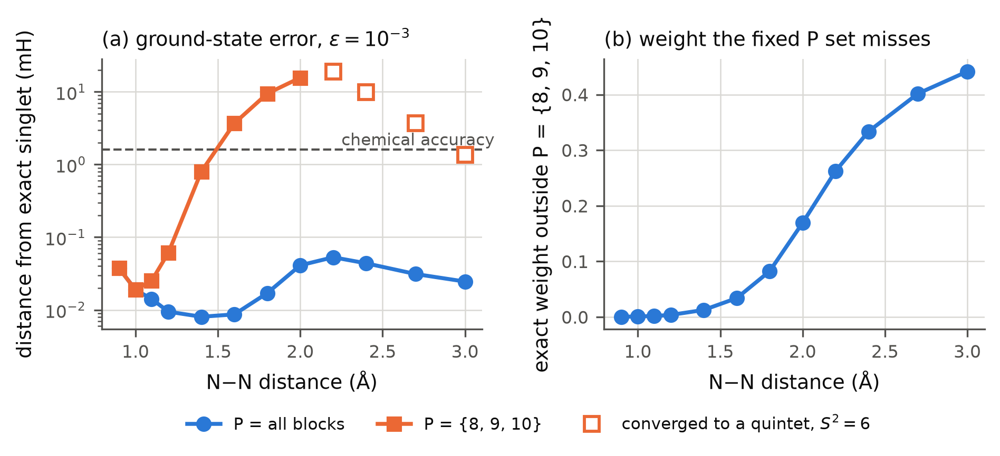

# Self-consistent Schmidt-basis downfolding: status report

*Prepared for a supervisor meeting, September 2026. Author: [student name].*

## Bottom line

- **Accuracy works.** From a starting guess that reads no exact CI coefficients,
  the method converges four states of N2, including an exactly degenerate
  ³Πg pair, to within chemical accuracy (worst 0.997 mH). Along the N2
  dissociation curve it stays within 0.053 mH of exact CASCI when all
  electron-number blocks are kept in P; with the usual fixed P space it fails
  (section 3).
- **Cost does not, and cannot in the current formulation.** Every stage holds
  dense vectors over the full active space, so the method is always more
  expensive than exact Davidson on the same problem: about 5,800 s against
  0.7 s for the four N2 states.
- **I do not think this is a paper on its own.** Most of what we learned about
  the self-consistent loop is known in the DMRG and numerical linear algebra
  literature, and an accurate method that is thousands of times slower than the
  exact answer is hard to motivate.
- **I propose moving to a determinant-space effective Hamiltonian** in which the
  Q space is compressed using the exact rank bound rank(H_PQ) ≤ |P|. That is
  close to your dCI, and I would like your view on it before going further.

## 1. The method in one paragraph

The active orbitals are split into A (the occupied orbitals) and B. The CI
coefficients of the target states are grouped by the number of electrons in A,
and a state-averaged Schmidt basis is built from their singular value
decomposition. The resulting product basis is split into P and Q by electron
count; Q is folded onto P by a residual-dressed wave operator, solved as a
Hermitian generalized Ritz problem; and the reconstructed coefficients are fed
back to rebuild the basis until nothing changes. Exact CASCI is used only to
score results.

## 2. What works

**Four states at equilibrium.** N2, cc-pVDZ, CAS(10e,9o), 15,876 determinants,
four lowest roots:

| threshold | embedded dimension | S0 Ag | S1 B1u | S2 B2g | S3 B3g |
|---|---|---|---|---|---|
| 2×10⁻³ | 4,779 | 0.80 | 2.59 | 1.30 | 1.52 |
| 1×10⁻³ | 6,805 | 0.30 | 1.71 | 0.75 | 0.87 |
| 5×10⁻⁴ | 9,887 | **0.13** | **1.00** | **0.46** | **0.51** |

*Errors in mH against exact CASCI. The degenerate pair's splitting falls
monotonically to 0.04 mH, as it should.*

Getting there required one real fix. The default starting guess had a projection
of 10⁻²⁶ on the ³Πg pair, because those states have strong double-excitation
character and a Krylov chain started from low-energy determinants cannot reach
their symmetry. Since the loop can never add rank it has lost, those two states
were unreachable, 29 to 30 mH off, while the ground state was fine (panel a). A
starting guess that includes one determinant of every irreducible representation
fixes it (panel b).

**Dissociation.** N2 ground state, full-valence CAS(10e,8o), 0.9 to 3.0 Å. With
all electron-number blocks in P the error stays below 0.053 mH everywhere, a
non-parallelity error of 0.045 mH.

## 3. What does not work

**Cost.**

| | Hamiltonian applications in the full space | wall time | memory |
|---|---|---|---|
| exact Davidson, 6 roots | 145 | 0.7 s | tens of MB |
| our starting guess alone | 357 | | |
| full method at 5×10⁻⁴ | | 5,778 s | 9.1 GB |

*Davidson was timed on my workstation and the method on the group cluster, which
is about 1.4 times slower, so the method would take roughly 4,000 s locally.*

The starting guess by itself already costs more than solving exactly. The deeper
reason is structural: the guess, the Schmidt decomposition and the construction
of the embedded Hamiltonian all work with full-length CI vectors. Any system small
enough for this to run is small enough for Davidson, which is cheaper, so the
formulation cannot reach the regime where exact CI is impossible.

**A fixed P space breaks as the bond stretches** (orange in the figure). With P
fixed to the three blocks nearest the Hartree-Fock electron count, the error grows
from 0.04 mH to 15.6 mH by 2.0 Å, tracking the weight the exact state has
outside P. From 2.2 Å the calculation converges, and reports convergence, to a
**quintet** instead of the singlet. The cause is root flipping in the model space:
restricted to P, the lowest eigenstate becomes a quintet beyond about 2.05 Å,
because the singlet depends on configurations outside P that the quintet does not
need. This is the classic intruder problem of effective Hamiltonians, here
changing the spin state.

**Self-consistency adds little.** Compared with freezing the basis after the
first iteration, at the same basis size, self-consistency gains 0.3 to 0.5 mH,
and it does so by making the ground state about 1 mH worse and the excited states
better. An earlier estimate of 2.5 to 2.8 mH turned out to be an artefact and has
been withdrawn (below).

## 4. Problems found and fixed along the way

Each of these produced results that looked converged and reasonable and were
wrong:

- **Reference energies.** Asking the CASCI solver for exactly four roots silently
  returned the wrong fourth root, 27 mH too high, which made a steeply falling
  error curve look flat. Fixed by requesting more roots and checking stability.
- **Symmetry.** Turning on point-group symmetry, needed for the new starting
  guess, made PySCF restrict every CI solve to one symmetry, which drops both
  excited-state symmetries. Fixed by keeping symmetry in the orbitals only.
- **Starting guess.** The Krylov chain lost orthogonality with more steps and at
  14 steps produced a "ground state" 17.5 Ha *below* the exact one. Fixed by
  re-orthogonalizing.
- **Withdrawn result.** The 2.5 to 2.8 mH self-consistency advantage recorded
  earlier came from a starting guess that could not reach two of the four states
  and from the faulty reference above. A fair comparison gives 0.3 to 0.5 mH.

All numbers above were checked against their sources after these fixes, and a
test now guards each fix.

## 5. My assessment

An analysis paper built on this work would contain some solid observations: the
downfolding is exact at convergence, so all error is basis truncation; the loop
cannot add rank to its own basis; the starting guess must cover every target
symmetry;
and a fixed P space root-flips during bond breaking. But the loop's behaviour is
largely known from DMRG, the numerical problems are textbook, and the method has
no advantage to offer. I do not think it would pass review at JCTC or JCP, and I
would rather not base a first paper on it. The material could serve as
supporting analysis in a later paper if the next approach succeeds.

## 6. Proposed next step

Work directly in the determinant space: select a P space of determinants and
fold Q onto it with an effective Hamiltonian,
H_eff(E) = H_PP + H_PQ (E − H_QQ)⁻¹ H_QP. Because rank(H_PQ) ≤ |P| exactly, P can
only "see" at most |P| directions of Q. Those directions, refined by block
Lanczos on H_QQ, give the resolvent without ever forming or storing H_QQ, and the
columns of H_QP are sparse vectors generated one P determinant at a time. The
cost is then set by |P| and the sparsity of H_QP rather than by the size of the
full space, which is exactly what the current method lacks.

Much of the machinery already exists in the repository from the earlier Krylov-dCI
work. I have opened a separate branch, and its first step is only an inventory of
that code and a measurement of cost against Davidson. No new method code will be
written until the approach is agreed.

## 7. Questions for you

1. Is any of the analysis in section 5 worth keeping for a later paper, or should
   it stay as internal notes?
2. How does the proposed determinant-space scheme relate to the recursive cluster
   screening in your dCI? Is there overlap I should avoid, or is it a natural
   extension?
3. What would a result need to show to be publishable: which benchmark system, and
   which competing methods at matched cost?
4. If the cost looks promising on N2, can I use the group cluster for a system
   where exact CASCI is not feasible?

## Where everything is

Repository branch `research/iterative-ci-feasibility`. Detailed write-ups in
`docs/development/`: `n2_threshold_curves.md`, `seed_irrep_coverage_finding.md`,
`n2_dissociation_results.md`, `seed_cost_versus_exact_solve.md`,
`size_consistency_finding.md`, `lanczos_seed_orthogonality_defect.md`. A longer
manuscript-style draft is in `docs/manuscript/`, kept for reference only.
