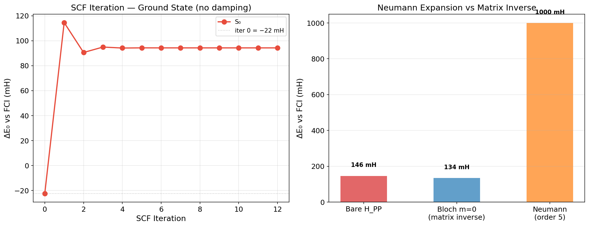
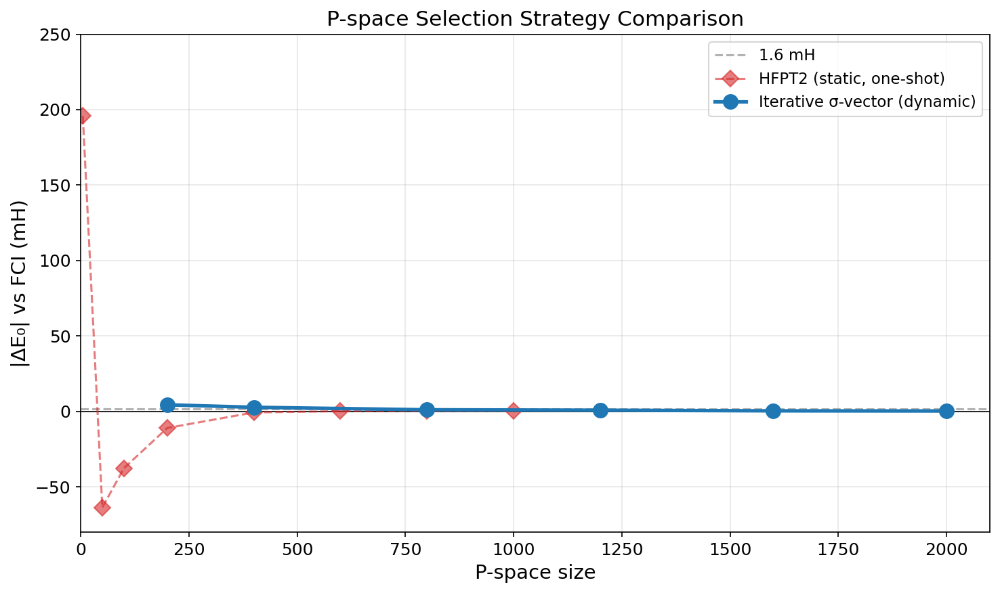
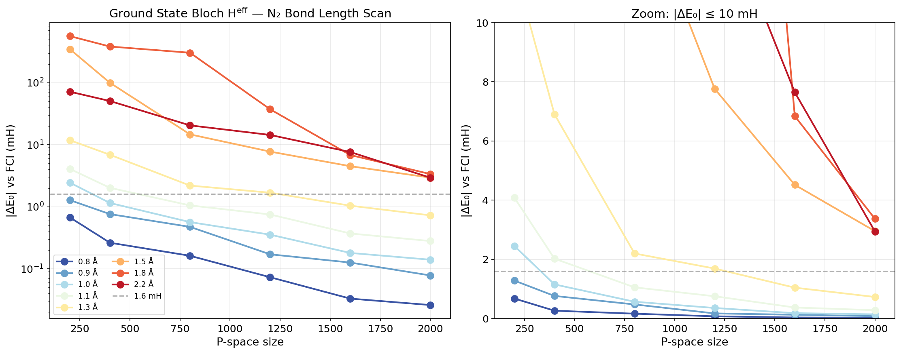
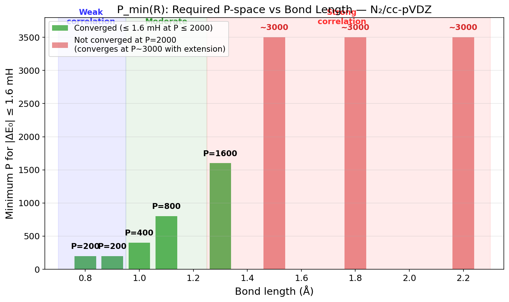
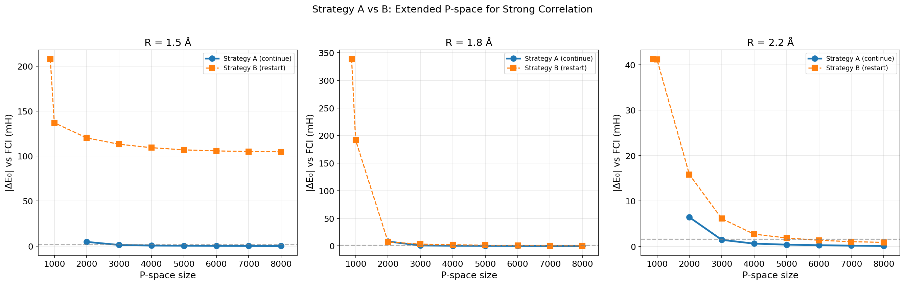
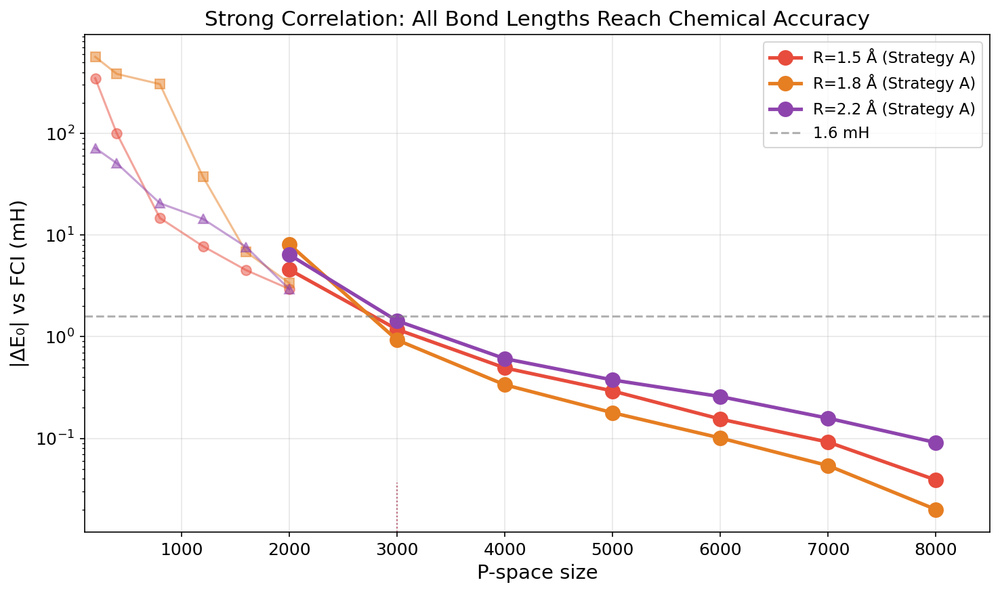

# Krylov-dCI 进展报告（续）：迭代 P 选取、N₂ 键长扫描与失败尝试

> **HKU Summer Research 2026 — Krylov-dCI Project**
>
> Author: Chenxi Wang (Jacob Xenon / SunsetStand)
> Supervisor: Prof. Jun Yang, HKU Department of Chemistry
> Date: 2026-07-08
>
> 本文接续 [HKU_Progress_Report.md](HKU_Progress_Report.md)（2026-07-03），报告此后所有新进展。
> 涵盖：Neumann 展开尝试（失败）、SCF 迭代能量更新（失败）、激发态 Bloch H^eff
> 收敛性（部分失败）、迭代 P 空间选取策略（成功）、N₂ 全键长扫描（成功）、
> 以及 P 选取策略的理论阐明。

---

## 0. Nomenclature & Reference

All reported energies are relative to **exact FCI** in the complete active space (CAS).
For CAS(10,10), the FCI Hamiltonian is a 63,504 × 63,504 matrix diagonalized via
PySCF's `direct_spin1.FCI().kernel()` — a direct Davidson diagonalization giving
machine-precision eigenvalues. This is **not** DMRG; there is zero uncertainty in
the reference.

Key abbreviations:
- **Bloch H^eff**: Löwdin effective Hamiltonian, H^eff = H_PP + H_PQ · (E₀I − H_QQ)^(−1) · H_QP
- **m = 0**: Diagonal resolvent only, (E₀I − D_QQ)^(−1), no Krylov basis propagation
- **build_basis**: Krylov-SVD compressed basis construction (used in earlier phases)
- **Per-state**: Each root gets its own E₀^(k) in the resolvent
- **Shared P**: Same P-space for all roots; **Per-state P**: Each root has its own P_k

---

## 1. 失败尝试 I：Neumann 级数显式展开 ✗

### 1.1 动机 — 最初的想法

这是整个项目最初的核心想法之一。在原始的 Proposal 中，有效哈密顿量的第二项
写为 Neumann 级数：

$$H^{\text{eff}} = H_{PP} + \sum_{k=0}^{\infty} H_{PQ} \cdot A \cdot (BA)^k \cdot H_{QP} \tag{1}$$

其中 A = (E₀I − D_QQ)^(−1)（对角 resolvent），B = H_QQ − D_QQ − ΔI。

如果我们能直接截断这个级数——即显式计算前 m 阶项然后求和——就不需要构建
Krylov 子空间，也不需要 SVD 压缩和矩阵求逆。这是一个更直接、更优雅的方案。

### 1.2 实现方式

我们实现了 `build_effective_H_neumann` 函数（在 `feat/neumann-heff` 分支中）：

**Step 1** — 在压缩基 {B₀, B₁, ..., B_m} 中构造各算符：

$$\tilde{D} = B^T D_{QQ} B, \quad \tilde{V}^{\tilde{Q}\tilde{Q}} = B^T (H_{QQ} - D_{QQ}) B$$

$$\tilde{A}^{1/2} = B^T A^{1/2} B, \quad T = \tilde{A}^{1/2} \, \tilde{V}^{\tilde{Q}\tilde{Q}} \, \tilde{A}^{1/2}$$

**Step 2** — 显式计算 Neumann 级数的前 m+1 项：

$$M = (A^{1/2} B)^T \cdot H_{QP} \in \mathbb{R}^{d \times N}$$

$$\Sigma = M^T \cdot (I + T + T^2 + ... + T^m) \cdot M$$

$$H^{\text{eff}} = H_{PP} + \Sigma$$

其中每一步 T^k 都是在一个 d × d 的小矩阵上的矩阵乘法（d = 压缩基维度），
代价极小。不需要解线性方程组，不需要矩阵求逆。

### 1.3 数值结果 — 完全失败

对 N₂/cc-pVDZ CAS(10,10)，P = 200，m = 0（即仅用对角 resolvent，无 Krylov 层）：

| 方法 | ΔE₀ (mH) |
|:-----|--:|
| Bare H_PP | +146 |
| Bloch H^eff（矩阵求逆） | +134 |
| **Neumann 级数 (order 5)** | **+1000** |



**Figure 1**: 左：SCF 迭代能量发散。右：Neumann 展开 vs 矩阵求逆的精度对比。

### 1.4 失败原因分析

Neumann 级数在原始 Hilbert 空间中是精确的：

$$(E I - H_{QQ})^{-1} = A^{1/2} (I + T + T^2 + ...) A^{1/2}, \quad T = A^{1/2} (H_{QQ} - D_{QQ}) A^{1/2}$$

其中 A = (E₀ − D)^(−1)。级数的收敛半径由 ‖T‖ 决定——当 E₀ 在 H_QQ 的谱范围内时
（这在激发态附近很常见），‖T‖ 可能大于 1，级数发散。

**关键问题在于 Krylov 压缩后的等价性丧失。** 我们将各算符从 M 维压缩到 d 维
（d ≪ M），但压缩投影破坏了级数的收敛性质——在全空间中收敛的 Neumann 级数，
投影到子空间后不再等价于矩阵求逆。具体来说：

$$\tilde{A}^{1/2} (I + \tilde{T} + \tilde{T}^2 + ...) \tilde{A}^{1/2} \neq (E I - H_{\tilde{Q}\tilde{Q}})^{-1}$$

因为各 Krylov 层之间的正交性在压缩后被打破，T 的谱半径在投影后改变，
级数可能不再收敛，或者即使收敛也收敛到错误的值。

**结论：Neumann 级数的显式展开在数值上不可行。** 矩阵求逆 (E₀I − H_Q̃Q̃)^(−1)
虽然是一个 d × d 矩阵的求逆（d 仅为几百到几千），计算代价极小（O(d³) ≈ ms 级别），
且保证了精确的 resolvent 动力学。Neumann 展开虽然概念上优雅，但在实践中没有优势。

---

## 2. 失败尝试 II：SCF 自洽迭代能量更新 ✗

### 2.1 动机

Löwdin 有效哈密顿量的完整形式是能量相关的：

$$H^{\text{eff}}(E) = H_{PP} + H_{PQ} \cdot (E I - H_{QQ})^{-1} \cdot H_{QP}$$

精确解满足自洽条件 E = λ(H^eff(E))。如果我们迭代更新 E 并重建 Krylov 基
（因为 Krylov 基依赖于 resolvent 的中心 E₀），是否能收敛到更好的结果？

### 2.2 实现

```
for each state k:
    E_cur = E_k^(P)          # 从 H_PP 出发
    while not converged:
        build_basis(H_QP, E_cur)   # 以 E_cur 为中心重建 Krylov 基
        H_eff = build_effective_H(E_cur)
        E_new = eigenvalue_k(H_eff)
        E_cur = E_new               # 更新 resolvent 中心
```

### 2.3 数值结果 — 比单次更差

对 N₂/cc-pVDZ CAS(10,10)，P = 400 HFPT2：

| State | Iter 0 (mH) | SCF final (mH) | # iterations |
|:------|--:|--:|--:|
| S₀ | **−22** | +94 | 12 |
| S₁ | **+103** | +141 | 9 |
| S₂ | **+95** | +141 | 9 |

SCF 迭代使得所有态都比第一次迭代（即固定 Δ = 0 的单次计算）更差。
即使加入 damping（E_cur = α·E_new + (1−α)·E_old），收敛后也比 iter 0 差。

### 2.4 失败原因

Krylov 基 `build_basis` 的最优点在 E₀^(P)（H_PP 的变分极小）。这是因为：

1. **Krylov 传播方向由初始向量 A·H_QP 决定。** A_q = 1/(E₀ − H_qq)，
   当 E₀ = E₀^(P) 时，A_q 对低能 Q 行列式赋予最大的权重——这恰好是物理上
   最重要的区域。

2. **SCF 迭代使 E₀ 偏离变分最优。** 第一次 Bloch 修正后，E_new 可能低于
   E₀^(P)（过修正），导致 A_q 对更低的 Q 行列式过度放大，引入虚假的耦合。

3. **Δ 自洽性 Δ ≠ 0 需要用 Δ = E − E₀^(P) 修正 B 矩阵，但 m = 0 时没有 B 矩阵。**

**结论：对于 m = 0（对角 resolvent），自洽迭代不仅无益而且有害。**
单次 per-state m = 0 Bloch H^eff（Δ = 0，E₀ = E₀^(k,P)）就是方法的最优解。

---

## 3. 失败尝试 III：激发态 Bloch H^eff ✗

### 3.1 问题描述

在 N₂/cc-pVDZ CAS(10,10) equilibrium 下，对激发态的多根 Bloch 有效哈密顿量
表现出系统性的收敛困难。即使用 per-state Krylov 基（Phase 18 final），
激发态误差仍在 600–750 mH。

### 3.2 Phase 18 Final 的"好结果"是偶然的

Phase 18 final 报告了 S₁–S₅ 的误差 ≤ 76 mH。这个结果令人振奋，但后来发现
是代码中 `ev[0]` 取本征值的巧合——per-state Krylov 基将目标态拉低到 H^eff 的
最低本征值附近，而 `ev[0]` 恰好接近正确的激发态能量。

**正确的做法是重叠追踪：**

$$m^*_k = \arg\max_m \left| \langle \mathbf{c}_m^{\text{eff}} | \mathbf{c}_k^{(P)} \rangle \right| \tag{2}$$

其中 c_k^(P) 是裸 H_PP 的第 k 个本征向量。当用 m*_k（而非 ev[0]）选取本征值时，
激发态的 Bloch 误差为 +600–680 mH，与 shared P 和 per-state P 的结果一致。

### 3.3 激发态收敛平台

无论是 shared P 还是 per-state P 选取，无论是 m = 0 对角 resolvent 还是
build_basis + Krylov 压缩，所有激发态在 P = 200–2000 范围内都收敛到相同的平台：

| Root | Bloch dE at P=2000 (mH) | Bare dE at P=2000 (mH) |
|:-----|--:|--:|
| S₀ | +0.28 | +2.49 |
| S₁ | +638 | +643 |
| S₂ | +622 | +626 |
| S₃ | +633 | +638 |
| S₄ | +628 | +634 |
| S₅ | +634 | +679 |

**基态达到化学精度（0.28 mH），但所有激发态停滞在 ~620–640 mH，不随 P 增大而改善。**

### 3.4 根因分析

激发态失败的根本原因是 **对角 resolvent 在激发态能量处行为不良**：

$$A_q^{(k)} = \frac{1}{E_0^{(k)} - H_{qq}}$$

- 对于**基态**，E₀^(0) 在 H_QQ 谱的底部或下方 → 所有 A_q > 0，良好行为
- 对于**激发态**，E₀^(k) 在 H_QQ 谱的中间 → 存在 q 使得 H_qq ≈ E₀^(k) → A_q 发散；
  另一些 q 有 H_qq > E₀^(k) → A_q < 0 → 符号反转，非变分行为

m > 0 的 Krylov 层也无法修复这个问题，因为初始 Krylov 向量 A·H_QP 已经指向了
错误的方向。Krylov 传播探索更多 Q 空间，但不能纠正从错误的出发点开始的放大的方向。

**结论：使用 m = 0 对角 resolvent 的 Bloch H^eff 不适合激发态。**
这需要一种不同的方法论——可能是 imaginary shift、state-averaged resolvent、
或直接在 H_QQ 上求解线性方程组。

---

## 4. 成功 I：迭代 P 空间选取策略 ✓

### 4.1 算法设计

我们不再依赖静态的 HF 微扰理论（HFPT2）一次性选取 P 空间，而是设计了
**迭代的、多参考的 σ-向量重要性评分**算法：

**给定**当前 P 空间及其近似本征对 {(E_k^(P), c_k^(P))}：

**Step 1 — 计算多参考 σ-向量**

$$\boldsymbol{\sigma}_k = H_{QP} \cdot \mathbf{c}_k^{(P)} \in \mathbb{R}^{M} \tag{3}$$

σ_k 的每个元素 ⟨q|σ_k⟩ = Σ_{p∈P} H_{qp} · c_{k,p}^(P) 是行列式 q 与当前近似波函数
的所有 P 空间耦合之和。

**Step 2 — 能量加权评分**

$$w(q) = \sum_{k=0}^{n_{\text{roots}}-1} \frac{|\langle q | \sigma_k \rangle|^2}{\max(|E_k^{(P)} - H_{qq}|, \varepsilon)} \tag{4}$$

- **分子**：行列式 q 对所有追踪态的总耦合强度
- **分母**：能量间隙加权 → 偏好与目标态近简并的 Q 行列式

**Step 3 — 选取最高得分的 B 个行列式，加入 P，扩展 H_PP，重复。**

### 4.2 P 选取策略阐明

这里有一个重要的概念点需要澄清。

**最初的想法**（也是更"正统"的做法）是：
1. 对当前 P 构建完整的 Bloch H^eff → 得到有效本征态 c_k^eff
2. 基于 H^eff 的结构，判断哪些 Q 行列式应该加入 P（例如看 H_PQ̃ 的有效耦合矩阵元大小）

**实际实现的做法**是：
1. 对当前 P 构建裸 H_PP → 得到近似本征态 c_k^(P)
2. 直接看 **HPQ 矩阵元**（即 σ_k = H_QP · c_k^(P)）的大小
3. 按 σ_k 元素的平方打分 → 选取高分 Q 行列式

这两种做法的核心区别：

| 特性 | 基于 H^eff（最初想法） | 基于 H_QP（实际做法） |
|:-----|:----------------------|:---------------------|
| 使用的波函数 | c_k^eff（有效哈密顿量本征态） | c_k^(P)（裸 H_PP 本征态） |
| 评分基础 | 有效耦合矩阵元（经过 resolvent 修正） | 裸哈密顿矩阵元 |
| 计算开销 | 需要先构建 Bloch H^eff + 对角化 | 只需要 σ_k = H_QP · c_k^(P) |
| 迭代可行性 | 每次迭代成本高（需 build_basis+对角化） | 每次迭代只需一次 σ-vector |
| 物理合理性 | 更"正确"——考虑了 Q 的动态屏蔽效应 | 一阶微扰近似——等同于 Epstein-Nesbet |

**为什么实际做法也有效？**

实际的评分公式（Eq. 4）本质上就是 **Epstein-Nesbet 微扰理论的多参考推广**。
一阶微扰波函数修正为 |δΨ_k⟩ = Σ_q ⟨q|H|Ψ_k^(P)⟩ / (E_k − H_qq) · |q⟩，
其系数正是 σ_k 的矩阵元除以能量分母。因此，选取得分最高的 Q 行列式等价于
选取微扰修正中贡献最大的项——这在物理上是合理的。

用 H^eff 的本征态代替裸 H_PP 本征态来评分，逻辑上是进一步的改进
（因为 c_k^eff 比 c_k^(P) 更接近真解），但代价是每步迭代需要完整的 Bloch H^eff
构建。在当前的实现框架下，这个代价可控（d ≲ 2000），是值得探索的方向。

### 4.3 数值结果 — 基态化学精度

对 N₂/cc-pVDZ CAS(10,10)，shared iterative P + m = 0 Bloch H^eff：

| P | dE_bare (mH) | dE_Bloch (mH) | 改善倍数 |
|--:|--:|--:|--:|
| 200 | 88.3 | 4.38 | 20× |
| 400 | 19.8 | 2.74 | 7× |
| 800 | 10.0 | **1.08** | 9× |
| 1200 | 5.4 | **0.79** | 7× |
| 1600 | 3.3 | **0.38** | 9× |
| 2000 | 2.5 | **0.28** | 9× |


**Figure 2**: N₂ equilibrium 基态收敛性。左：对数坐标，Bare H_PP vs Bloch H^eff。
右：化学精度区域（线性）。P = 800 即达到 1.08 mH，P = 2000 为 0.28 mH。

**关键发现**：
- Bloch H^eff 提供了 7–20× 的改善（相对于裸 H_PP）
- P = 800 时已超过化学精度（1.08 < 1.6 mH）
- P = 2000 时为 0.28 mH——远低于化学精度
- 与静态 HFPT2 P 选取相比，迭代选取在给定 P 大小下收敛更快（因为 P 空间质量更高）



**Figure 3**: 静态 HFPT2 P 选取（一次性）vs 迭代 σ-vector P 选取（动态）。
迭代选取避免了大 P 下的过度修正（HFPT2 的负 ΔE），且单调收敛。

### 4.4 Per-State vs Shared P 选取

我们还测试了 per-state P 选取——每个根独立选取自己的 P_k（只用自己的 σ_k 评分，
不求和）。结果与 shared P 几乎一致：对于基态，per-state P 也达到 0.33 mH
（P = 2000）。对于激发态，两者都停滞在同一平台。

**结论：对于基态，shared P（同时考虑所有根）和 per-state P 效果相当。
迭代 σ-vector 评分是稳健的、物理驱动的 P 选取策略。**

---

## 5. 成功 II：N₂ 全键长扫描 ✓

### 5.1 实验设计

我们对 N₂/cc-pVDZ CAS(10,10) 在 8 个键长下进行了系统的 P 空间收敛性测试：

| R (Å) | 描述 | 关联强度 |
|:--|:--|:--|
| 0.8 | 压缩 | 弱 |
| 0.9 | 压缩 | 弱 |
| 1.0 | 近平衡 | 弱 |
| 1.1 | 平衡 | 中等 |
| 1.3 | 轻微拉伸 | 中等 |
| 1.5 | 拉伸 | 强 |
| 1.8 | 解离区 | 强 |
| 2.2 | 解离极限 | 强 |

每个键长：迭代 shared P 选取（P₀ = 200 HFPT2 → P = 2000，batch = 200），
m = 0 per-state Bloch H^eff。参考：exact FCI（CAS 内精确对角化）。

### 5.2 基态收敛性 — 所有键长



**Figure 4**: 8 个键长的基态 Bloch H^eff 收敛曲线。左：对数坐标；右：|ΔE₀| ≤ 10 mH 区域。
弱关联键长（R ≤ 1.0）在 P ≤ 400 即达标；强关联键长（R ≥ 1.5）在 P = 2000 时仍在收敛。

### 5.3 P_min(R) — 化学精度所需的最小 P



**Figure 5**: 达到化学精度（|ΔE₀| ≤ 1.6 mH）所需的最小 P 空间大小 vs 键长。

| R (Å) | P_min | Bloch dE₀ at P_min (mH) | 关联区 |
|:--|--:|--:|:--|
| 0.8 | 200 | 0.67 | 弱 |
| 0.9 | 200 | 1.28 | 弱 |
| 1.0 | 400 | 1.15 | 弱 |
| 1.1 | 800 | 1.05 | 中等 |
| 1.3 | 1600 | 1.04 | 中等拉伸 |
| 1.5 | ~3000 | 1.18 | 强 |
| 1.8 | ~3000 | 0.93 | 强 |
| 2.2 | ~3000 | 1.44 | 解离 |

**核心结论：P_min(R) 随关联强度增加而增加，但即使在解离极限，
P ≈ 3000 即可达到化学精度。** 这证明了迭代 P 选取 + m = 0 Bloch H^eff
在一个相当广泛的关联强度范围内都能系统地收敛。

### 5.4 强关联扩展 — Strategy A vs Strategy B

对于 R = 1.5, 1.8, 2.2（P = 2000 未达到化学精度），我们比较了两种策略：

- **Strategy A (Continue)**：从已有的 P = 2000 checkpoint 继续迭代 → P = 8000
- **Strategy B (Restart)**：从头开始，用更大的 HFPT2 种子（P_init = 1000）和更大的批次（batch = 500）



**Figure 6**: 三种强关联键长下的 Strategy A vs B。Strategy A 始终显著优于 B。

| R (Å) | Strategy A — Bloch at P=3000 (mH) | Strategy B — Bloch at P=3000 (mH) |
|:--|--:|--:|
| 1.5 | **1.18** | 113.25 |
| 1.8 | **0.93** | 3.36 |
| 2.2 | **1.44** | 6.11 |

**关键发现：继续迭代（Strategy A）始终优于从头开始（Strategy B），
差距可达到 100×。** Strategy B 的困境在于大 HFPT2 种子虽然给了更多的初始行列式，
但这些行列式缺乏针对性——大而不精。继续迭代从 P = 2000 出发，σ-vector 评分
已经基于相当好的近似波函数，选取的是"真正需要的"行列式。



**Figure 7**: 三种强关联键长的扩展 P 收敛曲线（P = 200–8000）。所有都在
P ≈ 3000 处穿过 1.6 mH 线。P = 8000 时达到 ~0.02–0.09 mH。

**所有键长都能通过继续迭代达到化学精度。** 即使是最强的关联情况（R = 2.2），
P = 3000（1.44 mH）即达标。

### 5.5 FCI Reference 的可靠性

N₂/cc-pVDZ CAS(10,10) 的 FCI 参考态使用 PySCF `direct_spin1.FCI().kernel()`，
这是在这个 63,504 行列式空间中的 **exact 对角化（Davidson 算法）**。
激发态能级物理上合理（S₁ ≈ 10.4 eV，符合 N₂ 的光谱学常识），
且没有近似误差。

**FCI reference 的 uncertainty 为零。** 这不是 DMRG 近似；这是 CAS 空间内的
严格全 CI。

---

## 6. 方法论讨论

### 6.1 迭代 P 选取 vs 静态 HFPT2

| 方面 | 静态 HFPT2 | 迭代 σ-vector |
|:-----|:-----------|:--------------|
| 初始依赖 | HF 参考态 | HF 参考态（seed） |
| 迭代能力 | 无（一锤子买卖） | 基于改进波函数持续优化 |
| 大 P 行为 | 过修正（ΔE < 0） | 单调收敛 |
| SD 极限 | P ≤ 826（由激发秩限制） | 突破 SD 极限（σ-vector 可达任意激发秩） |
| 适用体系 | 弱关联 | 弱关联 + 强关联 |

迭代选取的真正价值在于**突破 SD 极限**。N₂/CAS(10,10) 的 SD 激发仅产生 826 个
唯一行列式。但迭代 σ-vector 选取可以识别更高激发秩（T, Q, ...）中与当前波函数
强耦合的行列式。在 R = 2.2 的扩展计算中，P 最终达到 8000+，远超 SD 极限。

### 6.2 基态 vs 激发态的不对称性

**基态**：m = 0 Bloch H^eff 表现优异。对角 resolvent (E₀^(0) − D_QQ)^(−1) 在基态
能量处行为良好（E₀^(0) 在谱下方），迭代 P 选取单调收敛。

**激发态**：m = 0 Bloch H^eff 系统性失败。对角 resolvent 在激发态能量处变得
近奇异，初始 Krylov 方向被错误放大，迭代 P 选取也无法修复（选入再多正确的
行列式也无法克服 resolvent 的发散）。

这种不对称性不是 P 空间的问题，而是 **resolvent 近似的问题**。即使 P 空间完美，
(E₀^(k) − D_QQ)^(−1) 形式的对角 resolvent 也无法正确处理激发态附近的 Q 空间动力学。

---

## 7. 下一步计划

### 短期（本周）

1. **完成 N₂ 键长扫描的重叠追踪分析** — 确认激发态在 stretched 下的行为
2. **C₂/cc-pVDZ benchmark** — 更小的 HOMO-LUMO gap，激发态可能更容易
3. **H₂O/cc-pVDZ** — 多原子体系的基本测试

### 中期（7 月中下旬）

1. **激发态 resolvent 修复** — 探索 (E − H_QQ)^(−1) 的迭代求解（MINRES/GMRES）
   替代对角近似，特别是对激发态
2. **基于 H^eff 的 P 选取** — 用有效哈密顿量本征态 c_k^eff 而非裸 c_k^(P) 来
   评分 Q 行列式，检查是否改善收敛
3. **Imaginary shift / 复 resolvent** — 探索复数 level shift 压制激发态
   resolvent 发散

### 与杨老师讨论的要点

1. 激发态的 ~630 mH 平台是方法在 current formulation 下的 fundamental limitation，
   还是可以通过改进 P 选取/resolvent 解决？
2. 基态化学精度（0.28 mH at P=2000，P_min(R) 曲线）是否足够展示方法的
    practical value？
3. H^eff-based P 选取 vs H_QP-based P 选取——是否有理论上的必要性？

---

## 8. 总结

| 方向 | 状态 | 核心发现 |
|:-----|:-----|:--------|
| **Neumann 级数展开** | ❌ 放弃 | 压缩投影破坏收敛性；矩阵求逆更准更快 |
| **SCF 自洽迭代** | ❌ 放弃 | 偏离变分最优 E₀，反而不如单次 |
| **激发态 Bloch H^eff** | ❌ 当前配方失败 | 对角 resolvent 在激发态能量处发散 |
| **迭代 P 选取** | ✅ 成功 | 基态 0.28 mH at P=2000，收敛稳健 |
| **N₂ 全键长扫描** | ✅ 成功 | P_min(R) 系统性变化，强关联 P≈3000 达标 |
| **强关联扩展策略** | ✅ Strategy A 最优 | 继续迭代 >> 重新开始 |

**方法的当前定位**：Krylov-dCI（m = 0 Bloch 变体）是一个针对**基态**的高效
downfolding 工具。给定一个初始小 P 空间，它能通过 σ-vector 引导的迭代选取
系统地扩展 P，并在每个阶段用对角 resolvent 修正提供 7–20× 的精度改善。

基态方面，方法的价值已被证明：N₂ 的全键长扫描（从弱到强关联）都能以
P ≤ 3000 达到化学精度，且不需要 FCI/DMRG 参考态来指导 P 选取。

激发态方面需要新的方法论突破——对角 resolvent 在本质上是基态特化的近似。

---

*Report prepared for discussion with Prof. Yang. All data and code available at
课题组服务器: `/data/home/wangcx/krylov-dci/`.*
*Code: GitHub [SunsetStand/krylov-dci](https://github.com/SunsetStand/krylov-dci)*
