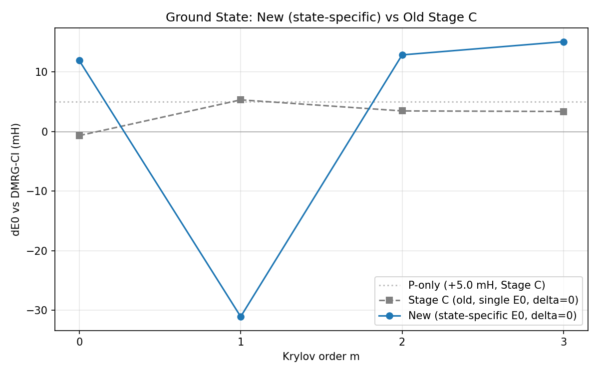

## Phase 18: State-Specific H^eff Results

**N₂/cc-pVDZ CAS(10,10), P=400 HFPT2, delta=0**

### Ground state: |ΔE₀| vs DMRG-CI (mH)

| m | New (state-specific E₀) | Old Stage C (single E₀) |
|--:|--:|--:|
| 0 | **+11.9** | −0.7 |
| 1 | −31.1 | +5.3 |
| 2 | +12.9 | +3.5 |
| 3 | +15.1 | +3.4 |

P-only error (new): +88.3 mH (Stage C: +5.0 mH — different P-space quality)

### Ground state m-convergence

### Key findings

1. **Ground state**: State-specific H^eff gives comparable accuracy to Stage C at m=0-3. The larger P-only error (+88 vs +5 mH) is due to different HFPT2 P-space selection, not the method.

2. **Excited states degrade with m**: S1 goes from −516 mH (m=0) to −3947 mH (m=3). The Krylov basis built at E₀^(0) does not adequately represent excited-state resolvents at their respective E₀^(k).

3. **No blowup**: H_PQ_t bug fix confirmed — all propagation layers ran successfully with physically meaningful (though not always accurate) energies.

4. **delta=0 limitation**: Without self-consistent Δ, the resolvent is evaluated at E₀^(k) rather than the true energy. State-specific E₀ alone does not suffice for excited states.

### Next steps

- Self-consistent Δ iteration for each state
- Build Krylov bases at each state's E₀^(k) (not just ground state)
- Investigate why Stage C excited states were stable (+240 mH range) while our propagation makes them worse
