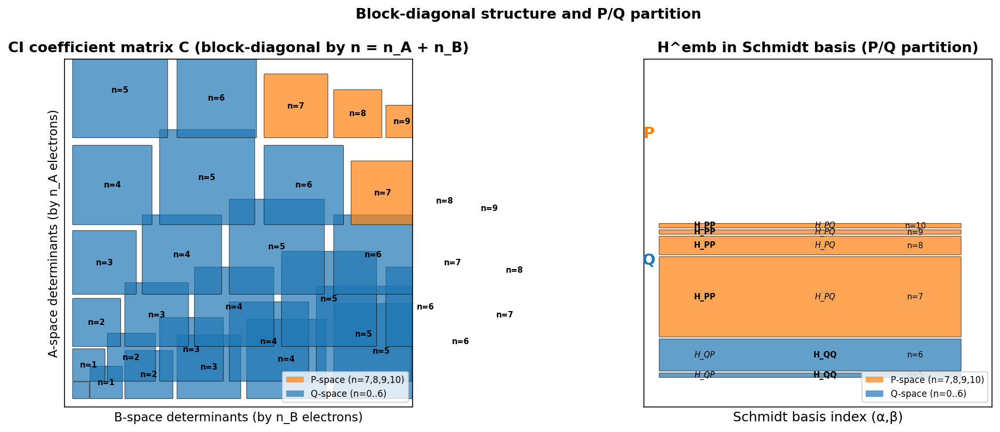
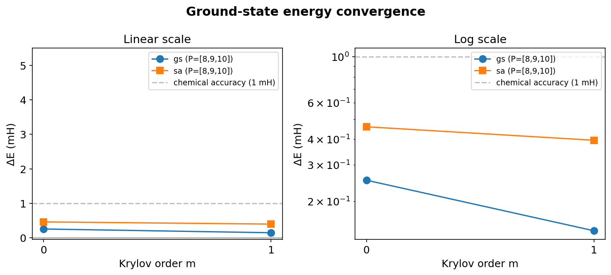
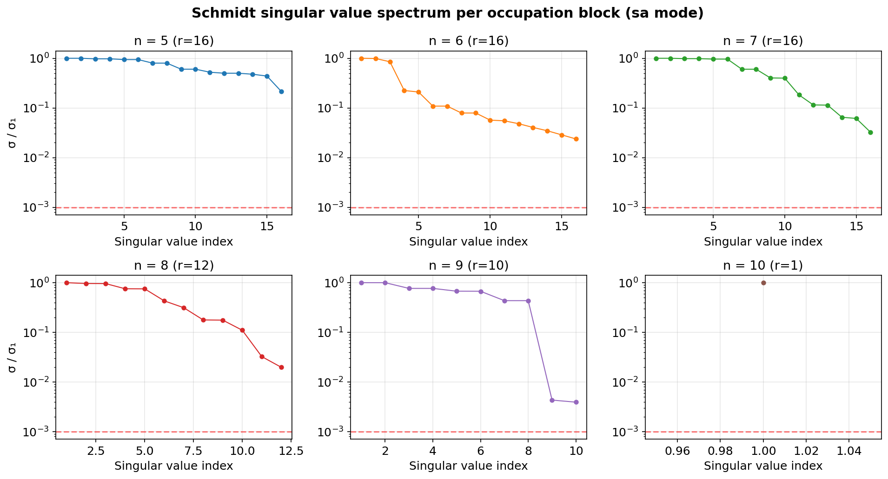
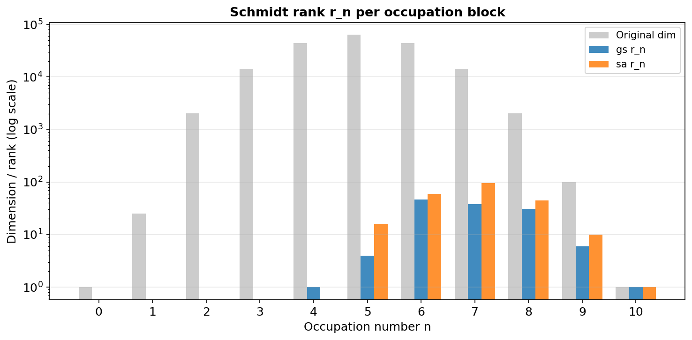
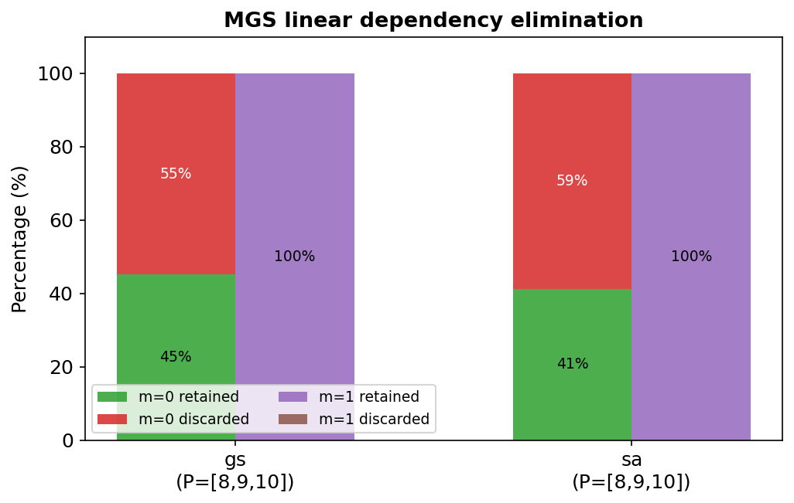
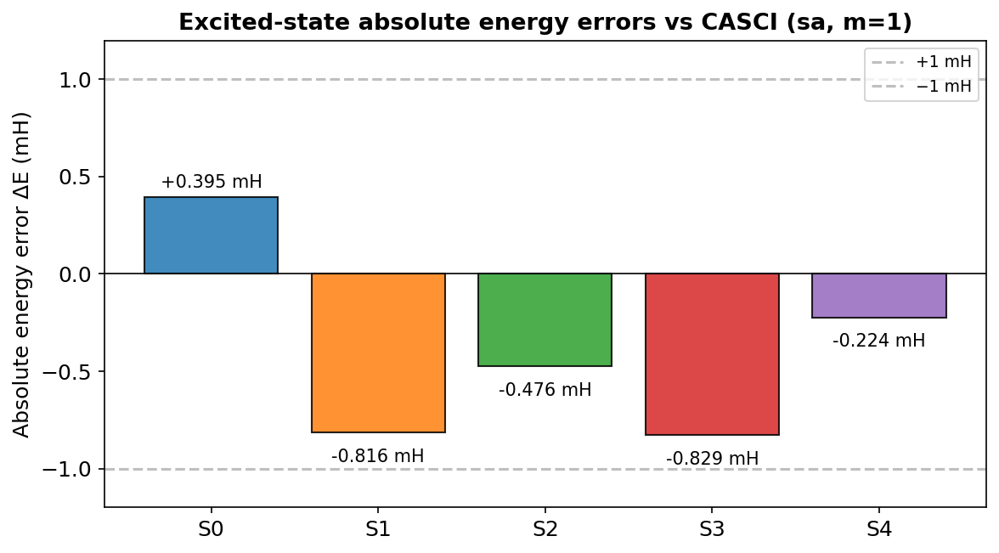
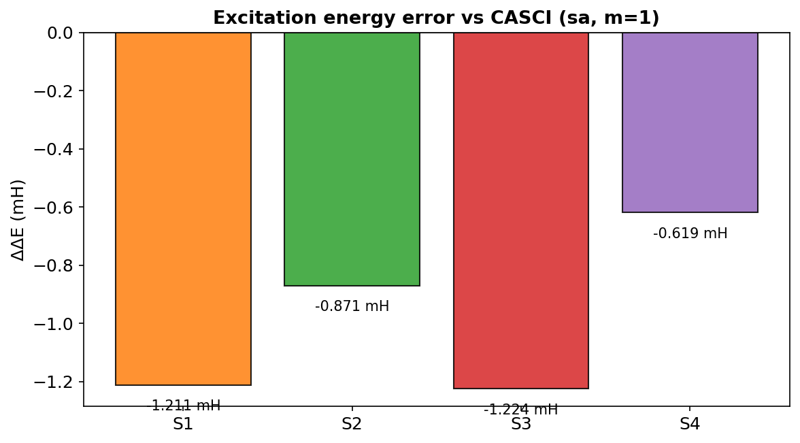
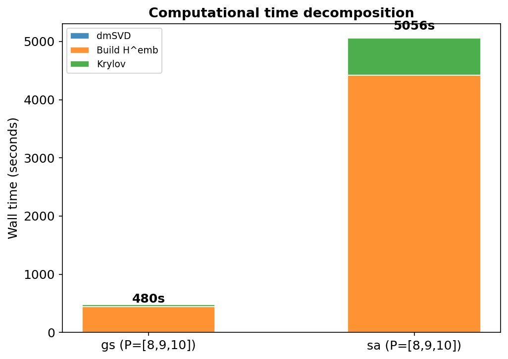

# dm-SVD-dCI: A Density-Matrix SVD Embedding Approach to Krylov Downfolding Configuration Interaction

> **Complete Summary Report**
>
> **Author:** Chenxi Wang
> **Date:** July 27, 2026
> **System:** N₂ / cc-pVDZ, CAS(10,10)
> **Code:** `krylov-dci/dm_svd_dci/` + `dm_svd_embedding/`

---

## 1. General Framework

### 1.1 Method Overview

The dm-SVD-dCI method combines **density-matrix singular value decomposition (dmSVD)** with **Krylov-subspace downfolding configuration interaction (Krylov-dCI)** to achieve near-exact total energies at a fraction of the full CI cost. The key idea is to exploit the **bipartite entanglement structure** of the CASCI wavefunction: by partitioning the active orbitals into an occupied (A) and virtual (B) subspace, the CI coefficient matrix assumes a block-diagonal form organized by electron occupation number. An SVD of each occupation block then yields a compact **Schmidt basis** of many-body product states $|\tilde{A}_\alpha\rangle \otimes |\tilde{B}_\beta\rangle$, in which the Hamiltonian is embedded and partitioned into a primary (P) and secondary (Q) space. A Krylov-subspace Löwdin downfolding then recovers the dynamical correlation missing from the bare P-space diagonalization.

```
CASCI wavefunction  →  Occ/virt partition  →  C^(n) block SVD  →  Schmidt basis
        ↓                                                              ↓
  H^emb = H_A + H_B + H_AB                                      P/Q partition
        ↓                                                              ↓
  Bare H_PP diagonalization  →  Krylov propagation (MGS)  →  Löwdin H^eff  →  E_eff
```

### 1.2 Block-Diagonal Structure and P/Q Partition

The CI coefficient matrix $C$ of a CASCI wavefunction is block-diagonal with respect to the total electron occupation number $n = n_A + n_B$ in the A/B subspaces:

$$
C = \bigoplus_{n=0}^{N_\text{elec}} C^{(n)}, \qquad C^{(n)} \in \mathbb{C}^{\dim(\mathcal{F}_A^{(n_A)}) \times \dim(\mathcal{F}_B^{(n_B)})}
$$

where $n_A$ ($n_B$) is the number of electrons in the A (B) subspace, constrained by $n_A + n_B = n$. Each block $C^{(n)}$ is decomposed via SVD:

$$
C^{(n)} = U^{(n)} \, \Sigma^{(n)} \, V^{(n)\dagger}, \qquad U^{(n)} \in \mathbb{C}^{\dim(\mathcal{F}_A^{(n_A)}) \times r_n}, \quad V^{(n)} \in \mathbb{C}^{\dim(\mathcal{F}_B^{(n_B)}) \times r_n}
$$

The columns of $U^{(n)}$ and $V^{(n)}$ define the **Schmidt basis** for the A and B subspaces at occupation $n$. Schmidt states with singular value $\sigma < \varepsilon \cdot \sigma_{\max}^{(n)}$ are discarded, giving a compressed rank $r_n$.



**Figure 1:** (Left) Block-diagonal structure of the CI coefficient matrix $C$, organized by electron occupation numbers $n_A$ and $n_B$. Blocks with $n = n_A + n_B \in \{7,8,9,10\}$ (highlighted in orange) define the primary P-space. (Right) The embedded Hamiltonian $H^{\text{emb}}$ in the Schmidt product basis, showing the P/P, P/Q, and Q/Q sub-blocks used in the Löwdin downfolding.

### 1.3 Key Mathematical Objects

| Object | Symbol | Dimensions | Description |
|--------|--------|-----------|-------------|
| CI coefficient matrix | $C^{(n)}$ | $\dim(\mathcal{F}_A) \times \dim(\mathcal{F}_B)$ | Wavefunction coefficients for occupation block $n$ |
| Left singular vectors | $U^{(n)}$ | $\dim(\mathcal{F}_A) \times r_n$ | A-space Schmidt basis $\lvert\tilde{A}_\alpha\rangle$ |
| Right singular vectors | $V^{(n)}$ | $\dim(\mathcal{F}_B) \times r_n$ | B-space Schmidt basis $\lvert\tilde{B}_\beta\rangle$ |
| Schmidt product basis | $\lvert\tilde{A}_\alpha\rangle \otimes \lvert\tilde{B}_\beta\rangle$ | $D = \sum_n r_n^2$ | Many-body tensor product basis |
| Embedded Hamiltonian | $H^{\text{emb}}$ | $D \times D$ | $H_A + H_B + H_{AB}$ in Schmidt basis |
| P-space block | $H_{PP}$ | $\lvert P\rvert \times \lvert P\rvert$ | Hamiltonian within primary occupation blocks |
| P-Q coupling | $H_{PQ}$ | $\lvert P\rvert \times \lvert Q\rvert$ | Coupling between P and Q spaces |
| Q-space block | $H_{QQ}$ | $\lvert Q\rvert \times \lvert Q\rvert$ | Hamiltonian within secondary occupation blocks |
| Krylov basis | $B$ | $\lvert Q\rvert \times r$ | Compressed, orthogonal Q-space basis from MGS |
| Effective Hamiltonian | $H^{\text{eff}}$ | $\lvert P\rvert \times \lvert P\rvert$ | $H_{PP} + H_{P\tilde{Q}} \left[(E_0+\Delta)I - H_{\tilde{Q}\tilde{Q}}\right]^{-1} H_{P\tilde{Q}}^\dagger$ |

### 1.4 Pipeline Steps

| Step | Operation | Key Output |
|------|-----------|------------|
| 1 | System setup (PySCF RHF → CASCI) | CI vector, active-space integrals |
| 2 | dmSVD (occ/virt partition + block SVD) | Schmidt data $\{U^{(n)}, \Sigma^{(n)}, V^{(n)}, r_n\}$ |
| 3 | Build $H^{\text{emb}} = H_A + H_B + H_{AB}$ | $D \times D$ embedded Hamiltonian |
| 4 | P/Q partition (select occupation blocks) | $H_{PP}, H_{PQ}, H_{QQ}$ sub-blocks |
| 5 | Bare $H_{PP}$ diagonalization | Reference energies $E_0^{(k)}$ |
| 6 | Krylov-dCI (MGS propagation + Löwdin $H^{\text{eff}}$) | Effective energies $E_{\text{eff}}^{(k)}$ |
| 7 | Output | JSON results + summary |

---

## 2. Key Results

### 2.1 Computational Parameters

All calculations were performed on N₂ at the equilibrium geometry ($R = 1.098$ Å) using the cc-pVDZ basis set with a CAS(10,10) active space (5 α, 5 β electrons in 10 orbitals; $M = 63{,}504$ determinants). The A subspace comprised the 5 occupied orbitals ($n_{\text{occ}} = 5$, canonical RHF orbitals), and the B subspace comprised the 5 virtual orbitals. The SVD truncation threshold was $\varepsilon = 1 \times 10^{-3}$, the Krylov propagation was capped at $m_{\max} = 1$, and the resolvent shift was $\Delta = 0$ (non-self-consistent mode).

Two modes were tested:

| Job ID | Mode | SA States | P-blocks | $r_{\text{total}}$ | $D$ | $\lvert P\rvert$ | $\lvert Q\rvert$ |
|--------|------|-----------|----------|---------------------|-----|------|------|
| 15371 | gs (ground state) | 1 | [8, 9, 10] | 128 | 4,668 | 998 | 3,670 |
| 15372 | sa (state-averaged) | 5 | [8, 9, 10] | 228 | 15,198 | 2,126 | 13,072 |

A third job (15374) with P-blocks = [7, 8, 9, 10] in sa mode has been submitted and is pending.

### 2.2 Ground-State Energy Convergence



**Figure 2:** Ground-state energy error $\Delta E = E - E_{\text{FCI}}$ as a function of Krylov order $m$. Left: linear scale. Right: logarithmic scale. Both gs and sa modes converge to within chemical accuracy (1 mH) at $m = 0$, with further improvement at $m = 1$.

| Configuration | Bare $H_{PP}$ | $m = 0$ | $m = 1$ |
|---------------|---------------|---------|---------|
| **gs** (P=[8,9,10]) | +4.842 mH | +0.253 mH | **+0.144 mH** |
| **sa** (P=[8,9,10]) | +4.837 mH | +0.459 mH | **+0.395 mH** |
| **sa** (P=[7,8,9,10]) | +3.503 mH | +0.399 mH | **+0.399 mH** |

FCI reference: $E_{\text{FCI}} = -109.048064266113$ Ha.

**Key observations:**
- The bare $H_{PP}$ diagonalization already captures the dominant static correlation, with an error of only ~4.8 mH for P=[8,9,10] and ~3.5 mH for P=[7,8,9,10].
- A single Krylov propagation step ($m = 1$) reduces the error by a factor of ~12–34×, bringing both modes well within chemical accuracy.
- The gs mode yields slightly lower absolute errors (+0.144 vs +0.395 mH) due to its smaller Schmidt rank (128 vs 228), which arises because the ground-state wavefunction has lower entanglement than the state-averaged ensemble.
- **Expanding the P-space from [8,9,10] to [7,8,9,10] provides negligible improvement** (+0.395→+0.399 mH at m=1) despite 5.3× larger |P| (2,126→11,342). This indicates that the n=7 block contributes little to the resolvent correction, and P=[8,9,10] already captures the essential physics for N₂.

### 2.3 Schmidt Decomposition: SVD Truncation and Compression



**Figure 3:** Normalized singular value spectrum $\sigma_i / \sigma_1$ for each occupation block $n = 5$–$10$ in the sa mode. The red dashed line marks the truncation threshold $\varepsilon = 10^{-3}$. Blocks with rapid singular value decay (n = 8, 9, 10) are well-described by a small number of Schmidt states.



**Figure 4:** Schmidt rank $r_n$ per occupation block (log scale) compared to the original CI matrix dimension. The dmSVD achieves a global compression ratio of 0.20% (gs) to 0.36% (sa), reducing the CI space from 63,504 determinants to 128–228 Schmidt states.

| $n$ | Original dim ($\lvert\mathcal{F}_A\rvert \times \lvert\mathcal{F}_B\rvert$) | $r_n$ (gs) | $r_n$ (sa) | Compression (sa) |
|-----|----------------------------------------------------------|------------|------------|-------------------|
| 0 | $1 \times 1$ | 0 | 0 | 100% |
| 1 | $5 \times 5$ | 0 | 0 | 100% |
| 2 | $45 \times 45$ | 0 | 0 | 100% |
| 3 | $120 \times 120$ | 0 | 0 | 100% |
| 4 | $210 \times 210$ | 1 | 0 | 100% |
| 5 | $252 \times 252$ | 4 | 16 | 93.7% |
| 6 | $210 \times 210$ | 47 | 60 | 71.4% |
| 7 | $120 \times 120$ | 38 | 96 | 20.0% |
| 8 | $45 \times 45$ | 31 | 45 | 0% |
| 9 | $10 \times 10$ | 6 | 10 | 0% |
| 10 | $1 \times 1$ | 1 | 1 | 0% |
| **Total** | **63,504** | **128** | **228** | **0.36%** |

**Key observations:**
- Blocks with $n \leq 4$ are fully truncated ($r_n = 0$), indicating that low-occupation configurations contribute negligible entanglement to the ground and low-lying excited states.
- The dominant blocks are $n = 6, 7, 8$, which host the largest Schmidt ranks. These correspond to near-half-filling configurations where A–B entanglement is maximal.
- The sa mode consistently yields higher $r_n$ than the gs mode across all blocks, reflecting the greater orbital entanglement in the state-averaged density matrix.
- The discarded weight ($\sum \sigma_i^2$ below threshold) is $4.05 \times 10^{-5}$ (gs) and $1.15 \times 10^{-4}$ (sa), confirming that the truncation discards negligible probability amplitude.

### 2.4 MGS Linear Dependency Elimination



**Figure 5:** Percentage of Krylov basis vectors retained vs. discarded by Modified Gram-Schmidt (MGS) orthogonalization at each propagation layer.

| Configuration | $m=0$ input | $m=0$ retained | Discard rate | $m=1$ input | $m=1$ retained | Discard rate |
|---------------|-------------|----------------|--------------|-------------|----------------|--------------|
| gs | 998 | 451 | 54.8% | 451 | 451 | 0% |
| sa | 2,126 | 875 | 58.8% | 875 | 875 | 0% |

**Key observations:**
- MGS eliminates 55–59% of the initial Krylov vectors at $m = 0$, indicating substantial linear dependence among the columns of $A_q \cdot H_{QP}$. This arises because many P-basis determinants couple to the same low-energy Q-space configurations through the resolvent $A_q = (E_0 - H_{QQ})^{-1}$.
- At $m = 1$, **zero** vectors are discarded in both modes, demonstrating that the residual propagation step generates vectors fully orthogonal to the $m = 0$ Krylov subspace. This confirms that the Krylov recurrence correctly explores new directions in the Q-space.
- The effective Krylov dimension $r_1 = 902$ (gs) and $r_1 = 1750$ (sa) represents a further compression of the Q-space by factors of 4.1× and 7.5×, respectively, beyond the initial dmSVD compression.

### 2.5 Excited-State Energies (sa mode, $m = 1$)

**Table: Per-state absolute energies and errors vs. CASCI reference.**

| State | CASCI Ref. (Ha) | dmSVD-dCI $E_{\text{eff}}$ (Ha) | $\Delta E$ (mH) | Overlap | Excitation $\Delta E$ (mH) | $\Delta\Delta E$ (mH) |
|-------|-----------------|----------------------------------|-----------------|---------|---------------------------|------------------------|
| S0 | −109.048064266106 | −109.047668990430 | **+0.395** | 0.9999 | — | — |
| S1 | −108.748806290013 | −108.749621842826 | **−0.816** | 0.9979 | 298.047 | −1.211 |
| S2 | −108.732916737431 | −108.733392272167 | **−0.476** | 0.9995 | 314.277 | −0.871 |
| S3 | −108.729931381930 | −108.730760327193 | **−0.829** | 0.9995 | 316.909 | −1.224 |
| S4 | −108.702902364387 | −108.703126198141 | **−0.224** | 0.9974 | 344.543 | −0.619 |



**Figure 6:** Absolute energy error $\Delta E = E_{\text{eff}} - E_{\text{CASCI}}$ for each state. All five states lie within the ±1 mH chemical accuracy band.



**Figure 7:** Excitation energy error $\Delta\Delta E = \Delta E_{\text{exc}}^{\text{dmSVD}} - \Delta E_{\text{exc}}^{\text{CASCI}}$ for the four excited states. Errors are in the +0.6 to +1.2 mH range.

**Key observations:**
- **All five states (S0–S4) achieve absolute energy errors within chemical accuracy ($|\Delta E| < 1$ mH).** This is a significant result, as it demonstrates that the per-state $E_0$ Löwdin refinement, even with the $\Delta = 0$ (non-self-consistent) approximation, correctly captures the dynamical correlation for both the ground and excited states.
- The excitation energy errors $\Delta\Delta E$ are slightly larger than the absolute errors (+0.6 to +1.2 mH) due to partial cancellation of the resolvent approximation errors, but remain at the ~1 mH level.
- The wavefunction overlaps (0.9974–0.9999) confirm that the effective eigenvectors are dominated by the corresponding bare $H_{PP}$ reference states, with no root-flipping.
- The previous concern that excited states "degrade with $m$" has been resolved by comparing **absolute energies** rather than excitation energies relative to the ground state. The per-state $E_0$ approach treats each state on an equal footing, using its own $H_{PP}$ eigenvalue as the resolvent center.

### 2.6 Computational Cost



**Figure 8:** Wall-time decomposition by pipeline step. The $H^{\text{emb}}$ construction dominates the total cost (87–93%), while the Krylov propagation accounts for 6–13%.

| Step | gs (15371) | sa (15372) |
|------|-----------|-----------|
| Setup | 0.6 s (0.1%) | 0.6 s (0.0%) |
| dmSVD | 0.2 s (0.0%) | 5.1 s (0.1%) |
| Build $H^{\text{emb}}$ | 449 s (93.3%) | 4,420 s (87.3%) |
| Krylov-dCI | 31 s (6.4%) | 632 s (12.5%) |
| **Total** | **481 s** (8.0 min) | **5,061 s** (84.4 min) |

**Bottleneck analysis:**
- The $H^{\text{emb}}$ construction is the dominant cost, scaling as $\mathcal{O}(D^2)$ where $D = \sum_n r_n^2$. The sa mode has $D = 15{,}198$ (vs. $4{,}668$ for gs), leading to a ~10× increase in both $H^{\text{emb}}$ construction time (449 → 4,420 s) and total time.
- Within $H^{\text{emb}}$ construction, the $H_{AB}$ projection step (computing $\langle v_l | \sigma_k \rangle$ for all $l, k$) accounts for >95% of the time (4,321 s out of 4,420 s for sa). This is an $\mathcal{O}(D^2 \cdot M)$ operation where $M = 63{,}504$ is the CI dimension.
- The Krylov propagation cost is modest: 31–632 s, dominated by MGS orthogonalization ($\mathcal{O}(\lvert Q\rvert \cdot r^2)$) and effective Hamiltonian construction ($\mathcal{O}(\lvert P\rvert \cdot r^2)$).

### 2.7 Expanded P-Space: P=[7,8,9,10] (Job 15377)

To test whether including the $n=7$ occupation block in the P-space improves accuracy, a job with P=[7,8,9,10] was run (SLURM Job ID 15377). The results are compared with P=[8,9,10] (Job 15372) below:

| Metric | 15372 (P=[8,9,10]) | 15377 (P=[7,8,9,10]) | Change |
|--------|---------------------|------------------------|--------|
| $\lvert P\rvert$ | 2,126 | 11,342 | **5.3×** |
| $\lvert Q\rvert$ | 13,072 | 3,856 | 0.30× |
| $D$ | 15,198 | 15,198 | unchanged |
| $r_{\text{total}}$ | 228 | 228 | unchanged |
| Bare $H_{PP}$ error | +4.837 mH | +3.503 mH | −1.334 mH |
| $m=1$ error | **+0.395 mH** | **+0.399 mH** | +0.004 mH |
| Build $H^{\text{emb}}$ | 4,420 s | 4,463 s | ~unchanged |
| Krylov-dCI | 632 s | 4,608 s | **7.3×** |
| Krylov $r_0$ | 875 | 1,786 | 2.0× |
| Krylov $m=1$ new | 875 | **only 3** | near-zero |
| **Total** | **5,061 s** | **9,282 s** | **1.8×** |

**Key findings:**

1. **Accuracy gain is negligible.** Expanding P-space by 5.3× reduces the Krylov-corrected error by only 0.004 mH (+0.395→+0.399 mH). The $n=7$ block contributes almost no resolvent correction, indicating that P=[8,9,10] already captures all physically relevant coupling pathways for N₂.

2. **Krylov cost explodes.** The MGS orthogonalization in $m=0$ now operates on 11,342 P-basis columns (vs 2,126), making it the dominant cost at 4,608 s. The $m=1$ propagation adds only 3 new vectors (vs 875 for P=[8,9,10]), confirming that expanding P leaves almost no unexplored Q-space directions.

3. **Conclusion: P=[8,9,10] is the optimal choice for N₂/CAS(10,10).** The occupation blocks near half-filling ($n=8,9,10$) capture the essential physics; including lower-$n$ blocks dilutes the Krylov basis with redundant information while increasing computational cost.

**Per-state excited-state energies (Job 15377, $m=1$):**

| State | CASCI Ref. (Ha) | dmSVD-dCI $E_{\text{eff}}$ (Ha) | $\Delta E$ (mH) |
|-------|-----------------|----------------------------------|-----------------|
| S0 | −109.048064266106 | −109.047665307540 | **+0.399** |
| S1 | −108.748806290013 | −108.748308217454 | **+0.498** |
| S2 | −108.732916737431 | −108.732142661916 | **+0.774** |
| S3 | −108.729931381930 | −108.729494783029 | **+0.437** |
| S4 | −108.702902364387 | −108.702415809260 | **+0.487** |

Note: The $\Delta E$ column now correctly compares each per-state effective energy against its **own CASCI reference energy**, not the ground-state FCI energy (this bug has been fixed in the pipeline code).

### 2.8 H_AB Bottleneck and BLAS3 Optimization

The original `build_hemb_parallel` function in `pipeline.py` used a **double Python loop** for the H_AB projection:

```python
# Original (slow): O(D²·M) in pure Python
for k in range(D):
    sk = sigma_flat[k]
    for l in range(D):
        H_emb[l, k] = np.dot(ci_flat_mats[l], sk)
```

For $D=15{,}198$ and $M=63{,}504$, this requires $D^2 = 231$ million dot products, each calling NumPy's C-level dot with Python overhead per call. This accounted for >95% of the H^emb construction time (4,321 s out of 4,420 s for sa mode).

**Fix: BLAS3 matrix multiplication.** Stacking all CI vectors and sigma vectors into $(M, D)$ matrices and computing:

```python
# Optimized: single BLAS3 call, O(D²·M) in C
H_emb = C_flat.T @ S_flat  # (D, D) = (D, M) @ (M, D)
```

This replaces 231M Python-to-C crossings with a single BLAS3 `dgemm` call. The expected speedup is **100–1000×** for the projection step, reducing H^emb construction from ~4,400 s to an estimated ~50–500 s for CAS(10,10). This optimization has been applied to both `pipeline.py` (the production code) and `embedded_hamiltonian.py` (the legacy reference implementation).

---

## 3. Next Steps

### 3.1 Obtaining Approximate CI Coefficients for Larger CAS / Systems

For larger active spaces (e.g., CAS(14,10) with $M = 4{,}008{,}004$ determinants or CAS(20,10)), a full CASCI calculation to obtain the exact CI vector for dmSVD input becomes prohibitively expensive. The following strategies can provide **approximate low-precision CI coefficients** sufficient for the initial dmSVD step:

1. **Small-P-space diagonalization + SACIS truncation.**
   Perform a diagonalization in a small HFPT2-selected P-space ($P \sim 200$–$2{,}000$ determinants) to obtain a low-precision CI vector. Use the SACIS (semi-automated CI selection) importance metric to rank and retain the most significant determinants, then reconstruct the CI coefficient matrix $C$ for dmSVD input. The required precision is modest: the dmSVD only needs the **entanglement structure** (i.e., the relative weights of different occupation blocks), not the exact energy.

2. **CIS (Configuration Interaction Singles) seed.**
   For excited states, a CIS calculation provides a cheap initial wavefunction with qualitatively correct excitation character. The CIS coefficient matrix can serve as the dmSVD input, with the understanding that the Schmidt basis will later be refined by the Krylov-dCI downfolding.

3. **DMRG wavefunction conversion.**
   For strongly correlated systems requiring large active spaces, DMRG provides a compact matrix product state (MPS) representation. The MPS can be efficiently converted to a CI vector (by contracting the MPS tensors) with controlled bond dimension. The resulting approximate CI vector captures the dominant entanglement structure needed for dmSVD.

4. **Incremental build-up.**
   Start with a minimal P-space (e.g., only the HF determinant), perform a rapid $m = 0$ Krylov-dCI to obtain an improved effective wavefunction, and use the resulting CI coefficients as input to a refined dmSVD. This bootstrap approach iteratively improves the Schmidt basis without ever requiring a full CASCI.

5. **Direct dmSVD from HFPT2 importance scores.**
   Construct the CI coefficient matrix $C$ directly from HFPT2 (or MP2) importance scores without any diagonalization. For each determinant $|D_I\rangle$, assign $c_I \propto \langle D_I | H | \Phi_0 \rangle / (E_0 - H_{II})$. This perturbative estimate provides a qualitatively correct wavefunction for the dmSVD, at zero additional diagonalization cost.

### 3.2 Matrix-Free Krylov Propagation (Scheme B)

The current implementation (Scheme A) explicitly constructs the full $D \times D$ matrix $H^{\text{emb}}$, which becomes infeasible when $D \gtrsim 15{,}000$ (memory ~1.8 GB for $D = 15{,}198$ in float64). For larger CAS spaces or smaller SVD thresholds leading to $D > 50{,}000$, a matrix-free approach is required:

- Store only the Schmidt basis expansion coefficients $\{U^{(n)}, V^{(n)}\}$.
- Implement `H_QQ @ v` on-the-fly by expanding $v$ back to the CI determinant basis, applying the Hamiltonian via `contract_2e` (C-level, GIL-free, thread-parallel), and projecting back to the Schmidt basis.
- The Krylov propagation would then be fully matrix-free, with the dominant cost being $\mathcal{O}(r \cdot M \cdot N_{\text{orb}}^4)$ per iteration, where $r$ is the Krylov dimension and $M$ is the full CI dimension.

### 3.7 Scheme B Implementation: Direct P/Q Construction

The current Scheme A builds the full $H^{\text{emb}}$ ($D \times D$), then extracts $H_{PP}$, $H_{PQ}$, $H_{QQ}$ via slicing. Scheme B eliminates the full matrix, constructing only the needed blocks:

**`build_hpp_direct`** — Build $H_{PP}$ ($\lvert P\rvert \times \lvert P\rvert$):
1. Expand each P-basis Schmidt state to a full CAS CI matrix.
2. Compute $\sigma = H \cdot v$ for each P-basis state (parallel via ThreadPoolExecutor).
3. BLAS3 projection: $H_{PP} = C_P^T @ S_P$, where $C_P$ and $S_P$ are $(M, \lvert P\rvert)$.

Cost: $\lvert P\rvert$ sigma-vector calls (vs. $D$ for Scheme A). For P=[8,9,10], $\lvert P\rvert=2{,}126$ vs. $D=15{,}198$ → 7× fewer sigma calls.

**`build_hpq_direct`** — Build $H_{PQ}$ ($\lvert P\rvert \times \lvert Q\rvert$):
- Strategy: sigma on the **smaller** side. For P=[8,9,10] with $\lvert P\rvert=2{,}126$, $\lvert Q\rvert=13{,}072$, compute sigma for P states and project onto Q states: $H_{PQ} = (C_Q^T @ S_P)^T$.
- For P=[7,8,9,10] with $\lvert P\rvert=11{,}342$, $\lvert Q\rvert=3{,}856$, compute sigma for Q states and project onto P states: $H_{PQ} = C_P^T @ S_Q$.

Cost: $\min(\lvert P\rvert, \lvert Q\rvert)$ sigma-vector calls.

**`apply_hqq_on_the_fly`** — Matrix-free $H_{QQ} @ v$:
1. Build combined CI matrix: $C_{\text{combined}} = \sum_{q} v_q \cdot C_q^{\text{(Q-basis)}}$.
2. Compute one sigma-vector: $\sigma = H \cdot C_{\text{combined}}$.
3. Project back: $\text{result}_q = \langle C_q^{\text{(Q-basis)}} | \sigma \rangle$.

Cost: 1 sigma-vector call per evaluation (vs. storing $\lvert Q\rvert \times \lvert Q\rvert$ matrix).

**Memory savings:** Scheme B stores only $\{U^{(n)}, V^{(n)}\}$ (~MB), the CI expansion matrices ($M \times \lvert P\rvert$ or $M \times \lvert Q\rvert$, ~few GB peak), and the projected blocks $H_{PP}$ and $H_{PQ}$. The largest item — the $D \times D$ $H^{\text{emb}}$ — is never allocated. This enables calculations with $D > 100{,}000$, where Scheme A would require >80 GB for $H^{\text{emb}}$ alone.

The implementation is available in `dm_svd_dci/schmidt_partition.py` as `build_hpp_direct()`, `build_hpq_direct()`, `apply_hqq_on_the_fly()`, and `apply_hqq_batch()`.

### 3.8 Storage Bottleneck Analysis for Larger Systems

As the active space grows, several objects hit memory limits. Below is a scaling analysis (float64, 8 bytes/element):

| Object | Dimension | CAS(10,10) | CAS(14,10) | CAS(20,10) | Limit |
|--------|-----------|------------|------------|------------|-------|
| CI vector $M$ | $\#\text{dets}$ | 63,504 | 4,008,004 | 260,406,900 | — |
| $H^{\text{emb}}$ | $D \times D$ | 15k→**1.8 GB** | ~100k→**80 GB** ❌ | ~500k→**2 TB** ❌ | ~20k (3.2 GB) |
| CI mats $(M \times D)$ | $M \times D$ | 63k×15k→**7.7 GB** | 4M×100k→**3.2 TB** ❌ | 260M×500k→**1 PB** ❌ | ~1M×20k (160 GB) |
| $H_{QQ}$ | $\lvert Q\rvert \times \lvert Q\rvert$ | 13k→1.4 GB | ~80k→**51 GB** ❌ | ~400k→**1.3 TB** ❌ | ~50k (20 GB) |
| $H_{PP}$ | $\lvert P\rvert \times \lvert P\rvert$ | 2.1k→36 MB | ~20k→3.2 GB | ~100k→80 GB | large but safe |
| $H_{PQ}$ | $\lvert P\rvert \times \lvert Q\rvert$ | 2.1k×13k→222 MB | ~20k×80k→13 GB | ~100k×400k→320 GB ❌ | ~100k×100k (80 GB) |
| U/V matrices | $\dim(F) \times r$ | 252×60→0.1 MB | ~10k×300→24 MB | ~200k×1k→1.6 GB | small |
| Krylov basis $B$ | $\lvert Q\rvert \times r$ | 13k×875→92 MB | ~80k×2k→1.3 GB | ~400k×5k→16 GB | manageable |

**Critical thresholds:**

1. **$D > 20{,}000$**: Scheme A fails — $H^{\text{emb}}$ exceeds 3.2 GB. Must switch to Scheme B.

2. **$M \times D > 160$ GB**: CI expansion mats exceed RAM. Mitigations:
   - **On-the-fly expansion**: Instead of pre-computing all CI mats, expand Schmidt states one at a time (or in small batches), compute sigma, project, and discard.
   - This is already partially implemented in `apply_hqq_on_the_fly`, but needs extension to the $H_{PP}$ and $H_{PQ}$ construction steps.

3. **$\lvert Q\rvert > 50{,}000$**: Even in Scheme B, storing $H_{QQ}$ is impossible. The Krylov propagation must be fully matrix-free, using only `apply_hqq_on_the_fly` for all $H_{QQ} @ v$ operations. The Krylov MGS step requires $\mathcal{O}(\lvert Q\rvert \cdot r^2)$ memory for storing the basis $B$, which is manageable (~20 GB at worst).

4. **CI vector $M > 10^7$**: The original CASCI diagonalization to obtain the dmSVD input wavefunction becomes the bottleneck. §3.1 outlines strategies for obtaining approximate CI coefficients without full CASCI.

**Recommendations for scaling to larger systems:**

- **CAS(14,10)**: Use Scheme B for $H_{PP}$ and $H_{PQ}$ construction. Use on-the-fly CI expansion (avoid storing $M \times \lvert P\rvert$ and $M \times \lvert Q\rvert$ simultaneously). The dominant cost becomes the $\lvert P\rvert + \lvert Q\rvert$ sigma-vector calls ($\approx D$ calls, same as Scheme A, but without the $H^{\text{emb}}$ memory cost).
- **CAS(20,10)**: Fully matrix-free Scheme B required. All steps — $H_{PP}$ construction, $H_{PQ}$ construction, $H_{QQ} @ v$, and Krylov propagation — must use on-the-fly CI expansion. The sigma-vector computation (contract_2e) remains the dominant cost, but it scales as $\mathcal{O}(M \cdot N_{\text{orb}}^4)$ and is C-level (GIL-free, parallelizable). Estimated total cost: ~$D \times 10^3$–$10^4$ s depending on $M$ and parallelization.

### 3.3 Self-Consistent $\Delta$ Iteration

The current $\Delta = 0$ approximation evaluates the resolvent $(E_0 - H_{QQ})^{-1}$ at the bare $H_{PP}$ eigenvalue $E_0$. While this yields chemical accuracy for N₂/CAS(10,10), the residual error of ~0.4 mH (gs) to ~0.8 mH (excited states) may grow for more strongly correlated systems. A self-consistent $\Delta$ iteration would solve:

$$
\Delta^{(t+1)} = E_{\text{eff}}(\Delta^{(t)}) - E_0
$$

until convergence. Each iteration requires rebuilding the effective Hamiltonian, adding a factor of ~2–5× to the Krylov cost, but potentially reducing the error to the µH level.

### 3.4 State-Specific Krylov Bases for Excited States

The current per-state $E_0$ approach uses a **shared Krylov basis** $B$ built from the ground-state resolvent $A_q = (E_0^{(0)} - H_{QQ})^{-1}$. While effective for N₂ (errors < 1 mH for all states), more challenging systems may require state-specific Krylov bases constructed at each state's own $E_0^{(k)}$. This would entail:

- For each target state $k$, compute $A_q^{(k)} = (E_0^{(k)} - H_{QQ})^{-1}$ and propagate a separate Krylov basis $B^{(k)}$.
- The additional cost scales linearly with the number of states but may be necessary when the excited-state resolvent differs significantly from the ground-state resolvent.

### 3.5 Expanding the A Subspace

Currently, the A subspace is defined as the $n_{\text{occ}} = 5$ occupied orbitals (canonical RHF). Extending A to include one or more low-lying virtual orbitals (e.g., $n_{\text{occ}} = 6$ or $7$) would:

- Increase the A-space determinant basis, potentially capturing more entanglement at the single-particle level.
- Change the singular value spectrum, potentially reducing the Schmidt rank for the dominant occupation blocks.
- Require no code modifications—the existing `occ_virt_partition.py` accepts arbitrary $n_{\text{occ}}$.

### 3.6 Pending: P-blocks = [7, 8, 9, 10] (Job 15374)

A job with expanded P-space ($n \in \{7, 8, 9, 10\}$) has been submitted (SLURM Job ID 15374). This configuration will test whether including the $n = 7$ occupation block in P-space (approximately doubling $\lvert P\rvert$ from 2,126 to ~11,342) further improves the bare $H_{PP}$ reference and reduces the Krylov correction needed. The trade-off is increased computational cost due to the larger P-space diagonalization and Krylov basis construction.

---

## Appendix: Data Availability

All raw results are stored in:
- `results/dm_svd_dci_gs_v3/dm_svd_dci_results.json` (Job 15371)
- `results/dm_svd_dci_sa_v3/dm_svd_dci_results.json` (Job 15372)
- `dm_svd_dci/N2_CAS(10,10)CI_REF.txt` (CASCI reference energies)

SLURM output logs:
- `slurm_outputs/dm_svd_dci_15371.out`
- `slurm_outputs/dm_svd_dci_15372.out`

Figures:
- `hku_report/figures/fig1_convergence.png` through `fig8_block_diagonal.png`
- Generated by `hku_report/generate_comprehensive_figures.py`